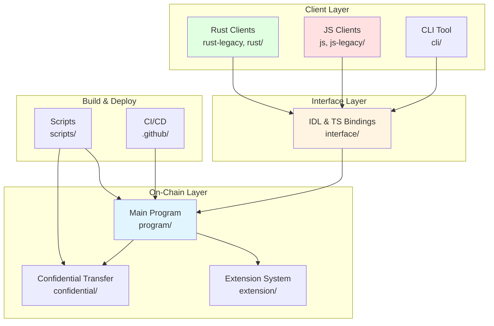
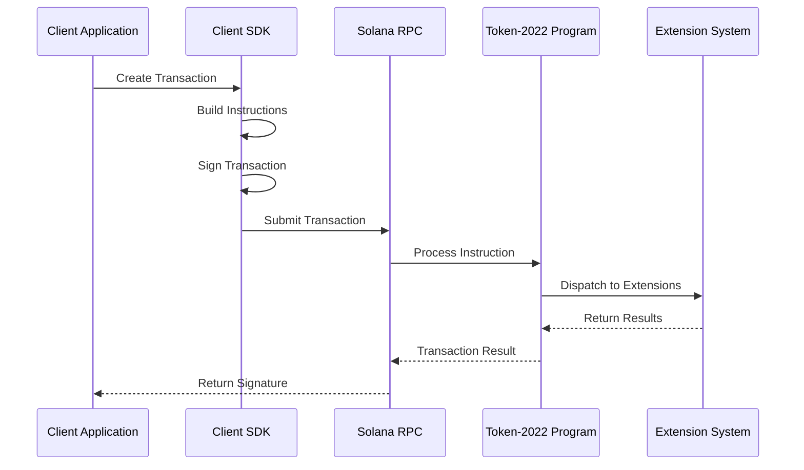

# 02. Project Structure - Solana Token 2022

## 📋 Topic Overview
- **Analysis Topic**: Project Structure
- **Project**: Solana Token 2022
- **Analysis Time**: 2026-03-09 20:15:00 GMT+8
- **Analysis Status**: ✅ Completed

---

## 🏗️ High-Level Directory Structure

```
token-2022/
├── program/                    # Main on-chain program (Rust)
│   ├── src/                    # Core program source
│   ├── tests/                  # Program tests
│   └── inc/                    # Build includes
├── interface/                   # IDL and TypeScript bindings
│   ├── src/                    # Interface source
│   ├── tests/                  # Interface tests
│   └── idl.json               # Interface Definition Language
├── clients/                    # Client libraries
│   ├── rust-legacy/            # Rust client (legacy)
│   ├── rust/                   # Rust client (auto-generated)
│   ├── js/                     # JavaScript client (auto-generated with Kit)
│   ├── js-legacy/              # JavaScript client (legacy)
│   └── cli/                    # Command-line interface
├── confidential/               # Confidential transfer implementation
│   ├── ciphertext-arithmetic/   # Confidential math operations
│   ├── elgamal-registry/       # ElGamal pubkey registry program
│   ├── elgamal-registry-interface/
│   ├── proof-extraction/       # ZK proof extraction
│   ├── proof-generation/       # ZK proof generation
│   └── proof-tests/            # Proof validation tests
├── confidential-transfer/       # Confidential transfer extension (legacy)
├── scripts/                    # Build and deployment scripts
├── zk-token-protocol-paper/    # Zero-knowledge token protocol docs
└── ai-analysis-docs/           # (Generated during analysis)
```

---

## 📦 Module Organization

### 1. Core Program (`program/`)

**Purpose**: Main on-chain token program implementing SPL Token 2022

**Key Files**:
- `src/processor.rs` (32,319 lines) - Main program logic and instruction processing
- `src/lib.rs` - Module exports and public API
- `src/entrypoint.rs` - Solana program entrypoint
- `src/onchain.rs` (28 KB) - On-chain operations
- `src/offchain.rs` (16 KB) - Off-chain operations
- `src/pod_instruction.rs` (26 KB) - POD instruction handling
- `src/state.rs` - Account state definitions
- `src/instruction.rs` - Instruction types
- `src/error.rs` - Error types
- `src/pod.rs` - Plain old data types
- `src/generic_token_account.rs` - Generic token account
- `src/native_mint.rs` - Native mint (SOL) handling

**Extension System** (`src/extension/`):
- `mod.rs` - Extension system core
- `reallocate.rs` - Account reallocation logic
- **23 Extension Modules** (see Extensions section below)

### 2. Interface (`interface/`)

**Purpose**: TypeScript/JavaScript bindings and IDL generation

**Key Files**:
- `src/instruction.rs` (98 KB) - Instruction definitions
- `src/state.rs` (21 KB) - State types
- `src/extension/` (23 modules) - Extension interfaces
- `idl.json` (341 KB) - Auto-generated IDL
- `src/error.rs` (23 KB) - Error types
- `src/pod.rs` (10 KB) - POD types
- `src/serialization.rs` (7 KB) - Serialization utilities
- `src/lib.rs` - Public API

### 3. Clients (`clients/`)

**Purpose**: Client SDKs for different languages and environments

#### 3.1 Rust Clients
- `rust-legacy/` - Legacy Rust client with comprehensive tests
- `rust/` - Auto-generated Rust client

#### 3.2 JavaScript/TypeScript Clients
- `js/` - Modern TypeScript client (auto-generated with Kit)
- `js-legacy/` - Legacy JavaScript client with extensive tests
- `cli/` - Command-line interface tool

**Test Coverage**:
- E2E tests (end-to-end integration)
- Unit tests (individual function testing)
- Extension-specific tests (for each Token 2022 extension)

### 4. Confidential Transfer (`confidential/`)

**Purpose**: Zero-knowledge proof-based confidential transfers

**Components**:
- `ciphertext-arithmetic/` - Encrypted value arithmetic
- `elgamal-registry/` - ElGamal pubkey registry (separate program)
- `elgamal-registry-interface/` - Registry interface
- `proof-extraction/` - Extract proofs from transactions
- `proof-generation/` - Generate ZK proofs
- `proof-tests/` - Proof validation and testing

### 5. Build & Scripts (`scripts/`)

**Purpose**: Build automation and deployment scripts

**Key Scripts** (from Makefile):
- `build-sbf-program` - Build Solana BPF program
- `build-sbf-confidential-elgamal-registry` - Build registry program
- `test-program` - Run program tests
- `restart-test-validator` - Start local validator
- `stop-test-validator` - Stop local validator
- `format-check-program` - Check code formatting
- `clippy-program` - Run Clippy linter

---

## 🔌 Extension System Architecture

### Extension Types (23 Extensions)

Each extension is a self-contained module with:

```
extension/{extension_name}/
├── mod.rs              # Extension type and state
├── instruction.rs      # Extension-specific instructions
├── processor.rs        # Extension logic implementation
└── account_info.rs     # Account types (for some extensions)
```

### Extension List

| Extension | Type | Purpose | Complexity |
|-----------|------|---------|------------|
| **Mint Extensions** |
| `transfer_fee` | Mint | Configure and collect transfer fees | Medium |
| `interest_bearing_mint` | Mint | Interest accrual on mint | Medium |
| `mint_close_authority` | Mint | Authority to close mint | Simple |
| `confidential_mint_burn` | Mint | Confidential mint/burn with ZK proofs | High |
| **Account Extensions** |
| `confidential_transfer` | Account | Confidential transfers with ElGamal encryption | High |
| `confidential_transfer_fee` | Account | Confidential transfer fees | High |
| `transfer_fee_amount` | Account | Track withheld fees | Medium |
| `memo_transfer` | Account | Memo field for transfers | Simple |
| `non_transferable` | Account | Make tokens non-transferable | Simple |
| `immutable_owner` | Account | Prevent owner changes | Simple |
| `pausable` | Account | Pause/unpause account | Simple |
| `permanent_delegate` | Account | Permanent delegate authority | Simple |
| `cpi_guard` | Account | Guard against CPI attacks | Medium |
| `default_account_state` | Both | Default account state | Medium |
| **Pointer Extensions** |
| `metadata_pointer` | Both | Point to external metadata | Simple |
| `group_pointer` | Both | Point to token group | Simple |
| `group_member_pointer` | Both | Point to group member | Simple |
| **Advanced Extensions** |
| `token_metadata` | Both | On-chain metadata (name, symbol, URI) | Medium |
| `token_group` | Both | Token grouping (size, max members) | Medium |
| `transfer_hook` | Both | Custom hook on transfers | High |
| `scaled_ui_amount` | Both | Scaling factor for UI display | Simple |

### Extension Organization Pattern

Each extension follows a consistent structure:

**mod.rs**:
```rust
pub mod instruction;
pub mod processor;

pub mod state;  // Extension state type
pub mod account_info;  // Account types (if needed)

pub struct Extension;
impl Extension for ExtensionType {
    const TYPE: ExtensionType = ExtensionType::MyExtension;
    // ...
}
```

**processor.rs**:
- Extension initialization logic
- Instruction processing
- Validation checks

**instruction.rs**:
- Extension-specific instruction types
- Instruction encoding/decoding

---

## 📊 Module Relationship Diagram



---

## 🔍 Detailed Component Analysis

### Core Program (`program/src/`)

**Entry Flow**:
```
entrypoint.rs → processor.rs → Extension Processors → State Updates
```

**Processor Responsibilities**:
1. Instruction validation
2. Account deserialization
3. Extension initialization/processing
4. State updates
5. CPI (Cross-Program Invocation) calls
6. Error handling

**Extension Processing**:
- Each extension has its own processor
- Processors handle extension-specific instructions
- Validation logic per extension
- Re-uses common utilities from `mod.rs`

### Interface Layer (`interface/src/`)

**IDL Generation**:
- From Rust structs to JSON IDL
- Used by Kit for client generation
- Includes all instruction types and account types

**TypeScript Bindings**:
- Auto-generated from IDL
- Type-safe API for JavaScript/TypeScript
- Includes all extension types

### Client Libraries

**Rust Client** (`clients/rust-legacy/`):
- Comprehensive test suite
- Direct Solana RPC interaction
- Extension-specific helper functions

**JavaScript Client** (`clients/js-legacy/`):
- Extensive test coverage (e2e, unit)
- Compatible with `@solana/web3.js`
- Extension APIs
- Transaction builders

**Auto-Generated Clients** (`rust/`, `js/`):
- Generated from IDL
- Type-safe bindings
- Always in sync with program changes

### Confidential Transfer System

**Architecture**:
```
User Transaction
    ↓
proof-generation/
    ↓
Ciphertext Arithmetic
    ↓
ElGamal Registry
    ↓
On-Chain Verification
    ↓
Confidential Transfer Extension
```

**Components**:
- `ciphertext-arithmetic/`: Encrypted value operations
- `proof-generation/`: ZK proof generation for privacy
- `proof-extraction/`: Extract and validate proofs
- `elgamal-registry/`: Manage public keys for encryption

---

## 📐 Data Flow Architecture



---

## 🎯 Key Design Patterns

### 1. Extension-First Architecture
- Core program is minimal
- All features implemented as extensions
- TLV format for flexible storage
- Type-safe extension system

### 2. Workspace Structure
- Rust workspace with multiple crates
- Shared dependencies via workspace
- Separate crates for program, interface, clients

### 3. Multi-Language Support
- Core in Rust (on-chain)
- Clients in Rust, JavaScript, TypeScript
- Auto-generation from IDL ensures consistency

### 4. Comprehensive Testing
- Unit tests (extension-specific)
- Integration tests (client-program interaction)
- E2E tests (full transaction flows)
- Proof tests (confidential transfer validation)

### 5. Build Automation
- Makefile for common tasks
- CI/CD via GitHub Actions
- Program and client generation automated

---

## 📦 File Distribution

### By Language
```
Rust Files:         214 (program + interface + confidential + clients)
JS/TS Files:        708 (clients)
JSON Files:         ~100 (package.json, configs, IDL)
Markdown Files:      ~20 (documentation)
Other:              ~8,260 (build artifacts, git, etc.)
```

### By Component
```
program/src/            ~50 files
interface/src/          ~30 files
clients/                ~600 files (including tests)
confidential/           ~40 files
scripts/                ~20 files
tests/                  ~100 files
```

---

## 🔧 Build Structure

```
target/
├── debug/
│   ├── build/          # Build artifacts
│   ├── deps/           # Dependencies
│   └── sbf/            # Solana BPF binaries
├── release/            # Release builds
└── wasm32-unknown-unknown/  # WebAssembly builds
```

**Build Outputs**:
- `program.so` - Solana BPF program binary
- Client libraries (Rust crates, JS packages)
- IDL files
- Documentation

---

## 📊 Complexity Assessment

### Most Complex Components
1. **`processor.rs`** (32,319 lines) - Main instruction processing
2. **`confidential_transfer/`** - ZK proof system
3. **`transfer_hook/`** - Custom transfer hooks
4. **Extension system** - TLV management and dispatch

### Test Distribution
- **Program tests**: Comprehensive coverage of instructions
- **Extension tests**: Each extension has dedicated tests
- **Client tests**: E2E and unit tests
- **Confidential tests**: Proof validation and encryption

---

## 🔗 Key Dependencies

### Rust Workspace
- `solana-program` - Solana SDK
- `solana-zk-sdk` - Zero-knowledge proofs
- `spl-token-2022-interface` - Shared types

### Client Dependencies
- `@solana/web3.js` - JavaScript SDK
- `@solana/kit` - Client generation tool
- `typescript` - TypeScript compiler

---

## 📝 Observations

### Strengths
1. **Clear separation** between on-chain and off-chain code
2. **Modular extension system** with consistent patterns
3. **Comprehensive client libraries** for multiple languages
4. **Extensive test coverage** across all components
5. **Well-documented architecture** with guide files

### Areas for Consideration
1. **Large processor file** (32K lines) could benefit from modularization
2. **Confidential transfer complexity** requires deep ZK knowledge
3. **Multiple client libraries** may cause maintenance overhead
4. **Extension dependencies** may create complex compatibility matrices

---

*This document was auto-generated by project-analyzer skill*
*Generated at: 2026-03-09 20:15:00 GMT+8*
