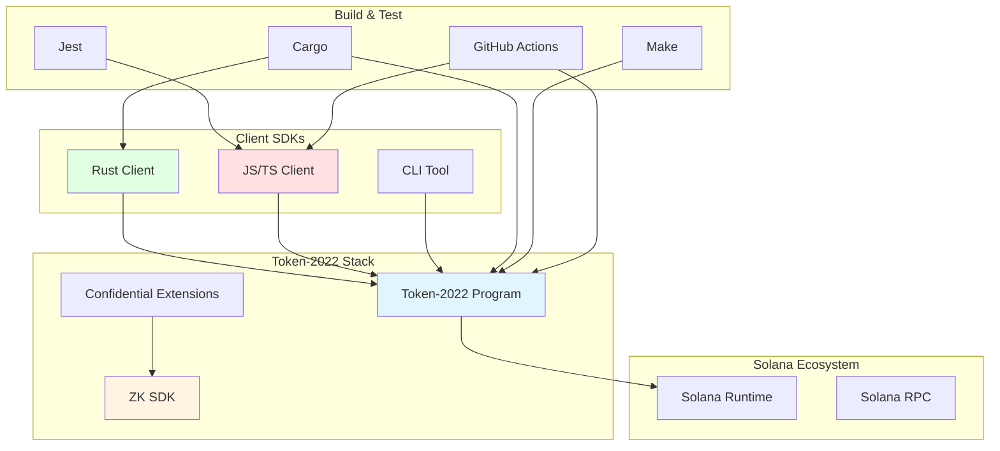

# 03. Tech Stack - Solana Token 2022

## 📋 Topic Overview
- **Analysis Topic**: Tech Stack
- **Project**: Solana Token 2022
- **Analysis Time**: 2026-03-09 20:30:00 GMT+8
- **Analysis Status**: ✅ Completed

---

## 🛠️ Primary Technologies

### Core Stack

| Component | Technology | Version | Purpose |
|-----------|-----------|---------|---------|
| **Blockchain** | Solana | - | Execution environment |
| **On-chain Language** | Rust | 2021 Edition | Smart contract implementation |
| **Off-chain Languages** | TypeScript, JavaScript | - | Client SDKs |
| **Build System** | Cargo, Make | - | Build automation |
| **Testing** | Rust Test Framework, Jest | - | Test framework |
| **CI/CD** | GitHub Actions | - | Continuous integration |

---

## 🔧 Rust Dependencies

### Core Solana Dependencies
```toml
solana-program = ">=2.0, <2.2"      # Solana SDK core
solana-zk-sdk = ">=4.0, <5.0"       # Zero-knowledge proofs
spl-token-2022-interface = ">=5.0, <6.0"  # Shared interfaces
solana-program-error = ">=2.0, <3.0"  # Error handling
solana-pubkey = ">=3.0, <4.0"       # Public key types
solana-sdk-ids = ">=2.0, <3.0"       # Program IDs
```

### ZK/Encryption Dependencies
```toml
curve25519-dalek = "4.1"             # Elliptic curve cryptography
elgamal = "0.1"                      # ElGamal encryption
solana-zk-token-proof-program = ">=1.0, <2.0"  # ZK proofs
```

### Utility Dependencies
```toml
borsh = { version = "1.5", features = ["derive"] }  # Serialization
bytemuck = { version = "1.16", features = ["derive"] }  # Byte casting
num-derive = "0.4"                 # Derive macros
num-traits = "0.2"                 # Numeric traits
```

### Build Toolchain
```toml
# workspace.metadata.toolchains
format = "nightly-2025-02-16"
lint = "nightly-2025-02-16"
```

---

## 📦 JavaScript/TypeScript Dependencies

### Core Dependencies
```json
{
  "@solana/web3.js": "^1.95.0",        // Solana JavaScript SDK
  "@solana/kit": "^1.0.0",             // Client generation
  "borsh": "^2.0.0",                  // Serialization
  "buffer-layout": "^1.2.2"            // Buffer management
}
```

### Development Dependencies
```json
{
  "typescript": "^5.6.0",
  "@types/node": "^25.0.0",
  "jest": "^29.7.0",
  "eslint": "^9.15.0",
  "prettier": "^3.4.0"
}
```

---

## 🏗️ Build Tools

### Rust Build Tools

**Cargo Features**:
- Workspace structure with multiple crates
- Custom profiles (dev with opt-level 3 for curve25519-dalek)
- Feature flags for conditional compilation

**Makefile Targets**:
```makefile
make build-sbf-program               # Build main program
make build-sbf-confidential-elgamal-registry  # Build registry
make test-program                    # Run tests
make format-check-program            # Check formatting
make clippy-program                 # Run linter
make restart-test-validator         # Start local validator
make stop-test-validator            # Stop local validator
```

**pnpm Commands**:
```bash
pnpm install                        # Install JS dependencies
pnpm generate:clients               # Generate clients from IDL
```

### Build Output Targets

**Solana BPF Target**:
- Target architecture: `sbf-solana-solana`
- Output: `.so` shared library
- Deployment: Deployed to Solana network

**Native Targets**:
- x86_64-apple-darwin (macOS)
- x86_64-unknown-linux-gnu (Linux)

---

## 🧪 Testing Frameworks

### Rust Testing

**Built-in Test Framework**:
- `#[cfg(test)]` modules
- Integration tests in `tests/` directory
- Property-based testing where applicable

**Test Structure**:
```
program/tests/          # Integration tests
├── extensions/         # Extension-specific tests
├── confidential/      # Confidential transfer tests
└── e2e/              # End-to-end tests
```

### JavaScript/TypeScript Testing

**Jest Framework**:
```
clients/js-legacy/test/
├── unit/             # Unit tests
└── e2e/              # End-to-end tests
```

**Test Categories**:
- Unit tests for individual functions
- E2E tests for full transaction flows
- Extension-specific tests

---

## 🔄 CI/CD Pipeline

**GitHub Actions Workflow** (`.github/workflows/main.yml`):

```yaml
# Key steps:
1. Checkout code
2. Setup Rust toolchain (nightly-2025-02-16)
3. Setup Node.js
4. Install dependencies (pnpm)
5. Run Rust tests
6. Run JS/TS tests
7. Run clippy
8. Check formatting
9. Build programs
```

**Status**: ✅ Active (badge in README)

---

## 📊 Dependency Diagram



---

## 🔒 Security & Cryptography

### Cryptographic Libraries

1. **Elliptic Curve Cryptography**
   - `curve25519-dalek` v4.1
   - Ed25519 signatures
   - X25519 key exchange

2. **ElGamal Encryption**
   - ElGamal encryption over Curve25519
   - Confidential transfer system
   - Implemented via `solana-zk-sdk`

3. **Zero-Knowledge Proofs**
   - Pedersen commitments
   - Range proofs
   - zk-SNARKs for confidential transfers

4. **Hashing**
   - SHA-256 via Solana SDK
   - Merkle tree operations (if needed)

### Security Best Practices

- ✅ Constant-time operations for crypto
- ✅ Secure random number generation
- ✅ Memory safety via Rust
- ✅ Audit of cryptographic implementations

---

## 🎯 Technology Choices

### Why Rust for On-Chain?

1. **Memory Safety**: Prevents common vulnerabilities
2. **Performance**: Zero-cost abstractions, efficient execution
3. **BPF Compatibility**: Compiles to Solana BPF target
4. **Type Safety**: Prevents many bugs at compile time
5. **Ecosystem**: Rich crates for cryptography and serialization

### Why TypeScript/JavaScript for Clients?

1. **Ecosystem**: Largest NPM package ecosystem
2. **Accessibility**: Most Solana developers use JS/TS
3. **Tooling**: Excellent IDE support and tooling
4. **Generation**: Kit can generate clients from IDL
5. **Web Compatibility**: Runs in browsers and Node.js

### Why TLV Extension System?

1. **Flexibility**: Add features without breaking changes
2. **Efficiency**: Compact storage format
3. **Type Safety**: Extension-specific types
4. **Composability**: Multiple extensions per account
5. **Upgradability**: Easy to add new extensions

---

## 📈 Performance Considerations

### On-Chain Performance

**Compute Budget**:
- Instruction processing optimized for low compute units
- Efficient serialization (borsh)
- Minimal CPI calls

**Storage Efficiency**:
- TLV format reduces wasted space
- Compact data types (Pod types)
- Optional extensions (only pay for what you use)

### Off-Chain Performance

**Client Performance**:
- Efficient transaction building
- Batch operations where possible
- Caching strategies

**Confidential Transfer Performance**:
- Proof generation (off-chain)
- Parallel verification (on-chain)
- Optimized arithmetic operations

---

## 🚀 Deployment

### Program Deployment

**Build Process**:
1. Compile Rust to Solana BPF (`.so`)
2. Deploy to Solana network via `solana program deploy`
3. Generate and save IDL

**Program Addresses**:
- Main program: `TokenzQdBNbLqP5VEhdkAS6EPFLC1PHnBqCXEpPxuEb`
- ElGamal registry: Separate program

**Networks**:
- Devnet (development)
- Testnet (testing)
- Mainnet-beta (production)

### Client Deployment

**Rust Client**:
- Published to crates.io: `spl-token-2022-client`

**JavaScript/TS Client**:
- Published to npm: `@solana-program/token-2022`
- Versioning aligned with program updates

---

## 📝 Technology Debt & Future Considerations

### Current Limitations
1. **Large processor file** (32K lines) - could be modularized
2. **Extension compatibility** - complex dependency matrices
3. **ZK proof generation** - computationally expensive (off-chain)

### Potential Improvements
1. **WASM support** for web-based clients
2. **Rust client generation** from IDL (currently partial)
3. **Extension validation tools** to check compatibility
4. **Optimized proof generation** for confidential transfers

---

## 🔗 Related Projects

- **Solana SDK**: Core Solana development kit
- **solana-zk-sdk**: Zero-knowledge proof utilities
- **@solana/kit**: Client generation tool
- **SPL Token**: Legacy token program (pre-2022)

---

*This document was auto-generated by project-analyzer skill*
*Generated at: 2026-03-09 2026-03-09 20:30:00 GMT+8*
