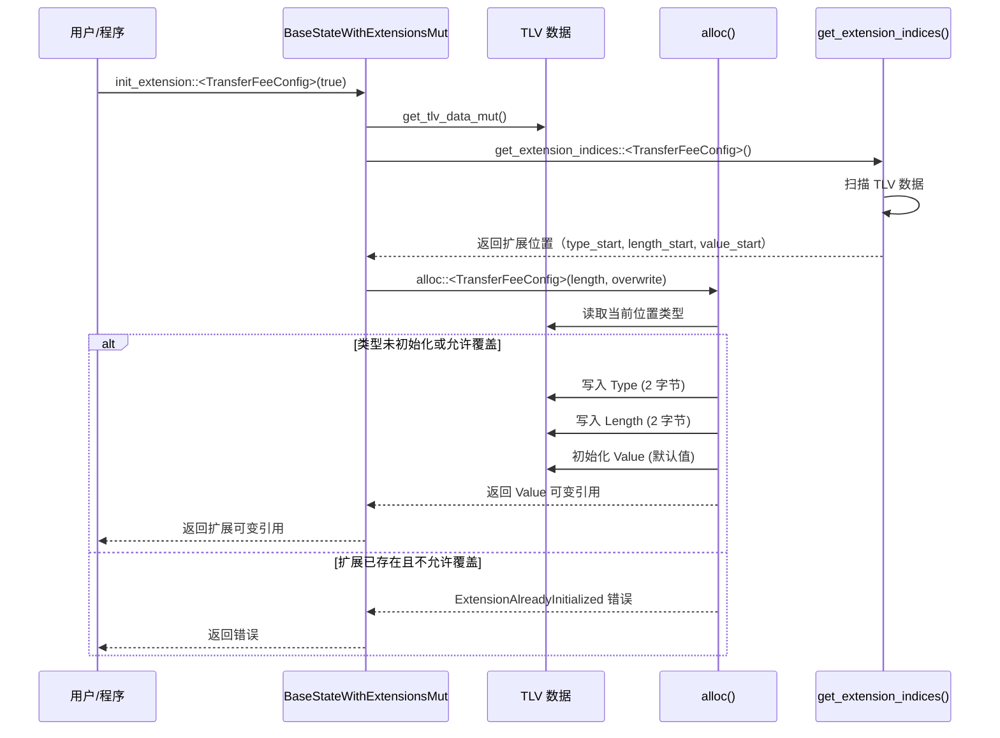
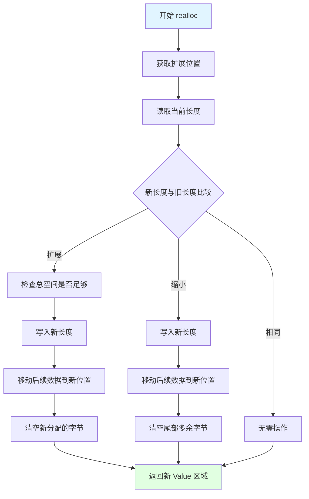

# TLV 扩展系统核心实现 - 深度分析

## 📋 分析概览
- **分析主题**: TLV (Type-Length-Value) 扩展系统
- **项目**: Solana Token 2022
- **分析时间**: 2026-03-09 21:30:00 GMT+8
- **分析状态**: ✅ 完成
- **代码位置**: `interface/src/extension/mod.rs` (3,137 行)

---

## 🎯 核心概念

TLV (Type-Length-Value) 是 Token 2022 的核心创新，提供了一种**灵活、可扩展的账户数据存储机制**。

### 为什么需要 TLV？

传统 SPL Token 的账户结构是固定的，无法动态添加新功能。TLV 系统允许：

1. **动态扩展**：在不破坏兼容性的情况下添加新功能
2. **按需付费**：只为启用的扩展支付存储成本
3. **灵活组合**：任意组合多个扩展
4. **类型安全**：每个扩展都有明确的类型定义

---

## 📐 TLV 数据结构详解

### 1. 内存布局

```
┌─────────────────────────────────────────────────────────┐
│  基础数据（Mint 或 Account）                     │
│  - Mint: 82 字节                                   │
│  - Account: 165 字节                               │
└─────────────────────────────────────────────────────────┘
┌─────────────────────────────────────────────────────────┐
│  Padding（填充到 BASE_ACCOUNT_LENGTH = 165）       │
└─────────────────────────────────────────────────────────┘
┌─────────────────────────────────────────────────────────┐
│  AccountType: 1 字节                              │
│  - 0x01: Mint                                      │
│  - 0x02: Account                                    │
└─────────────────────────────────────────────────────────┘
┌─────────────────────────────────────────────────────────┐
│  TLV 数据区域（变长）                             │
│  ┌─────────────────────────────────────────────┐   │
│  │ Type: 2 字节 (小端序 u16)            │   │
│  └─────────────────────────────────────────────┘   │
│  ┌─────────────────────────────────────────────┐   │
│  │ Length: 2 字节 (小端序 u16)          │   │
│  └─────────────────────────────────────────────┘   │
│  ┌─────────────────────────────────────────────┐   │
│  │ Value: Length 字节（扩展的具体数据）      │   │
│  └─────────────────────────────────────────────┘   │
│  ... 更多 TLV 条目（可选）                         │
└─────────────────────────────────────────────────────────┘
```

### 2. 关键常量

```rust
const BASE_ACCOUNT_LENGTH: usize = 165;  // Account::LEN
const MINT_SIZE: usize = 82;             // Mint 基础大小
const ACCOUNT_SIZE: usize = 165;         // Account 基础大小

// Type 和 Length 的固定大小
const EXTENSION_TYPE_SIZE: usize = 2;  // u16
const LENGTH_SIZE: usize = 2;           // PodU16
```

### 3. 索引计算

```rust
fn get_tlv_indices(type_start: usize) -> TlvIndices {
    let length_start = type_start.saturating_add(EXTENSION_TYPE_SIZE);
    let value_start = length_start.saturating_add(LENGTH_SIZE);
    TlvIndices {
        type_start,
        length_start,
        value_start,
    }
}
```

**示例**：
- 对于 Mint (SIZE_OF = 82):
  ```
  account_type_index = 165 - 82 = 83
  tlv_start_index = 83 + 1 = 84
  ```
- 对于 Account (SIZE_OF = 165):
  ```
  account_type_index = 165 - 165 = 0
  tlv_start_index = 0 + 1 = 1
  ```

---

## 🔌 ExtensionType 枚举（23 种扩展）

```rust
pub enum ExtensionType {
    // 基础扩展
    Uninitialized,                    // 未初始化标记
    
    // Mint 扩展
    TransferFeeConfig,               // 转账费用配置
    MintCloseAuthority,              // Mint 关闭权限
    ConfidentialTransferMint,         // 机密转账 Mint
    DefaultAccountState,            // 默认账户状态
    InterestBearingConfig,           // 计息配置
    PermanentDelegate,               // 永久委托
    TransferHook,                   // 转账钩子（Mint）
    ConfidentialTransferFeeConfig,    // 机密转账费用配置
    MetadataPointer,                // 元数据指针
    TokenMetadata,                 // 代币元数据
    GroupPointer,                  // 分组指针
    TokenGroup,                    // 代币分组
    GroupMemberPointer,             // 成员指针
    TokenGroupMember,              // 分组成员
    ConfidentialMintBurn,           // 机密 Mint/Burn
    ScaledUiAmount,                // 缩放 UI 金额
    Pausable,                     // 可暂停（Mint）
    
    // Account 扩展
    TransferFeeAmount,              // 转账费用金额
    ConfidentialTransferAccount,      // 机密转账账户
    ImmutableOwner,                // 不可变所有者
    MemoTransfer,                  // 备注转账
    NonTransferable,               // 不可转账（Mint）
    TransferHookAccount,            // 转账钩子（Account）
    ConfidentialTransferFeeAmount,   // 机密转账费用金额
    NonTransferableAccount,         // 不可转账（Account）
    PausableAccount,               // 可暂停（Account）
    CpiGuard,                     // CPI 保护
}
```

---

## 🔧 核心 Trait 设计

### 1. Extension Trait

所有扩展都必须实现 `Extension` trait：

```rust
pub trait Extension {
    /// 扩展类型标识
    const TYPE: ExtensionType;
    
    /// 关联的账户类型（Mint 或 Account）
    fn get_account_type(&self) -> AccountType;
}
```

**示例**：
```rust
// TransferFeeConfig 扩展
impl Extension for TransferFeeConfig {
    const TYPE: ExtensionType = ExtensionType::TransferFeeConfig;
    
    fn get_account_type(&self) -> AccountType {
        ExtensionType::TransferFeeConfig.get_account_type()
    }
}
```

### 2. BaseState Trait

基础状态（Mint 或 Account）的抽象：

```rust
pub trait BaseState {
    /// 基础数据大小
    const SIZE_OF: usize;
    
    /// 账户类型
    const ACCOUNT_TYPE: AccountType;
}
```

**实现**：
```rust
// Mint 实现
impl BaseState for Mint {
    const SIZE_OF: usize = 82;
    const ACCOUNT_TYPE: AccountType = AccountType::Mint;
}

// Account 实现
impl BaseState for Account {
    const SIZE_OF: usize = 165;
    const ACCOUNT_TYPE: AccountType = AccountType::Account;
}
```

### 3. BaseStateWithExtensions Trait

带扩展的状态操作：

```rust
pub trait BaseStateWithExtensions<S: BaseState> {
    /// 获取 TLV 数据的不可变引用
    fn get_tlv_data(&self) -> &[u8];
}
```

**变体**：
- `StateWithExtensions<'data, S>` - 不可变状态（需要反序列化）
- `PodStateWithExtensions<'data, S>` - 不可变 Pod 状态（零拷贝）
- `StateWithExtensionsOwned<S>` - 拥有数据的状态
- `StateWithExtensionsMut<S>` - 可变状态
- `PodStateWithExtensionsMut<S>` - 可变 Pod 状态

### 4. BaseStateWithExtensionsMut Trait

可变状态操作，提供扩展初始化和管理：

```rust
pub trait BaseStateWithExtensionsMut<S: BaseState>: BaseStateWithExtensions<S> {
    /// 获取 TLV 数据的可变引用
    fn get_tlv_data_mut(&mut self) -> &mut [u8];
    
    /// 获取账户类型的可变引用
    fn get_account_type_mut(&mut self) -> &mut [u8];
    
    /// 初始化扩展（Pod 类型）
    fn init_extension<V: Extension + Pod + Default>(
        &mut self,
        overwrite: bool,
    ) -> Result<&mut V, ProgramError>;
    
    /// 初始化扩展（可变长度类型）
    fn init_variable_len_extension<V: Extension + VariableLenPack>(
        &mut self,
        extension: &V,
        overwrite: bool,
    ) -> Result<(), ProgramError>;
    
    /// 重新分配扩展
    fn realloc<V: Extension + VariableLenPack>(
        &mut self,
        length: usize,
    ) -> Result<&mut [u8], ProgramError>;
    
    /// 获取扩展的可变引用
    fn get_extension_mut<V: Extension + Pod>(
        &mut self,
    ) -> Result<&mut V, ProgramError>;
}
```

---

## 🚀 核心算法分析

### 1. get_extension_indices - 扩展查找算法

```rust
fn get_extension_indices<V: Extension>(
    tlv_data: &[u8],
    init: bool,
) -> Result<TlvIndices, ProgramError> {
    let mut start_index = 0;
    
    while start_index < tlv_data.len() {
        let tlv_indices = get_tlv_indices(start_index);
        
        // 验证数据长度
        if tlv_data.len() < tlv_indices.value_start {
            return Err(ProgramError::InvalidAccountData);
        }
        
        // 读取 Type
        let extension_type = u16::from_le_bytes(
            tlv_data[tlv_indices.type_start..tlv_indices.length_start]
                .try_into()
                .map_err(|_| ProgramError::InvalidAccountData)?,
        );
        
        if extension_type == u16::from(V::TYPE) {
            // 找到目标扩展
            return Ok(tlv_indices);
        } else if extension_type == u16::from(ExtensionType::Uninitialized) {
            // 找到空位
            if init {
                return Ok(tlv_indices);  // 初始化模式：返回空位
            } else {
                return Err(TokenError::ExtensionNotFound.into());  // 搜索模式：错误
            }
        } else {
            // 跳过当前扩展
            let length = pod_from_bytes::<Length>(
                &tlv_data[tlv_indices.length_start..tlv_indices.value_start],
            )?;
            let value_end_index = tlv_indices.value_start.saturating_add(usize::from(*length));
            start_index = value_end_index;  // 移动到下一个扩展
        }
    }
    
    Err(ProgramError::InvalidAccountData)
}
```

**算法分析**：
- **时间复杂度**: O(n)，其中 n 是扩展数量
- **空间复杂度**: O(1)
- **关键点**: 
  - 线性扫描 TLV 数据
  - 找到目标扩展或空位时返回
  - 支持初始化和搜索两种模式

### 2. alloc - 扩展空间分配算法

```rust
fn alloc<V: Extension>(
    &mut self,
    length: usize,
    overwrite: bool,
) -> Result<&mut [u8], ProgramError> {
    // 1. 验证扩展类型匹配账户类型
    if V::TYPE.get_account_type() != S::ACCOUNT_TYPE {
        return Err(ProgramError::InvalidAccountData);
    }
    
    let tlv_data = self.get_tlv_data_mut();
    
    // 2. 查找扩展位置
    let TlvIndices {
        type_start,
        length_start,
        value_start,
    } = get_extension_indices::<V>(tlv_data, true)?;
    
    // 3. 验证空间足够
    if tlv_data[type_start..].len() < add_type_and_length_to_len(length) {
        return Err(ProgramError::InvalidAccountData);
    }
    
    // 4. 读取当前位置的扩展类型
    let extension_type = ExtensionType::try_from(&tlv_data[type_start..length_start])?;
    
    // 5. 关键判断：是否可以写入
    if extension_type == ExtensionType::Uninitialized || overwrite {
        // ✅ 可以写入
        
        // 写入 Type (2 字节)
        let extension_type_array: [u8; 2] = V::TYPE.into();
        tlv_data[type_start..length_start].copy_from_slice(&extension_type_array);
        
        // 写入 Length (2 字节)
        let length_ref = pod_from_bytes_mut::<Length>(&mut tlv_data[length_start..value_start])?;
        
        // 如果是覆盖模式，验证长度必须相同
        if overwrite && extension_type == V::TYPE && usize::from(*length_ref) != length {
            return Err(TokenError::InvalidLengthForAlloc.into());
        }
        
        *length_ref = Length::try_from(length)?;
        
        // 返回 Value 区域
        let value_end = value_start.saturating_add(length);
        Ok(&mut tlv_data[value_start..value_end])
    } else {
        // ❌ 扩展已存在且不允许覆盖
        Err(TokenError::ExtensionAlreadyInitialized.into())
    }
}
```

**算法分析**：
- **overwrite 参数详解**：
  - `true`: Mint 扩展初始化（总是允许覆盖）
  - `false`: Account 扩展初始化（防止重复初始化）
  
- **安全性检查**：
  - 扩展类型与账户类型匹配
  - 空间足够
  - 覆盖模式验证长度相同

### 3. init_extension - 扩展初始化算法

```rust
fn init_extension<V: Extension + Pod + Default>(
    &mut self,
    overwrite: bool,
) -> Result<&mut V, ProgramError> {
    // 1. 获取扩展的固定大小
    let length = pod_get_packed_len::<V>();
    
    // 2. 在 TLV 数据中分配空间
    let buffer = self.alloc::<V>(length, overwrite)?;
    
    // 3. 将字节转换为扩展类型的可变引用
    let extension_ref = pod_from_bytes_mut::<V>(buffer)?;
    
    // 4. 初始化为默认值
    *extension_ref = V::default();
    
    // 5. 返回可变引用，供调用者设置具体值
    Ok(extension_ref)
}
```

**使用示例**：
```rust
// TransferFeeConfig 初始化（Mint 扩展，overwrite = true）
let extension = mint.init_extension::<TransferFeeConfig>(true)?;
extension.transfer_fee_config_authority = authority.try_into()?;
extension.withdraw_withheld_authority = withdraw_authority.try_into()?;
extension.withheld_amount = 0u64.into();

// ConfidentialTransferAccount 初始化（Account 扩展，overwrite = false）
let confidential_account = 
    token_account.init_extension::<ConfidentialTransferAccount>(false)?;
confidential_account.approved = true.into();
confidential_account.elgamal_pubkey = elgamal_pubkey;
```

### 4. realloc - 扩展重新分配算法

```rust
fn realloc<V: Extension + VariableLenPack>(
    &mut self,
    length: usize,
) -> Result<&mut [u8], ProgramError> {
    let tlv_data = self.get_tlv_data_mut();
    
    // 1. 获取扩展位置
    let TlvIndices {
        type_start: _,
        length_start,
        value_start,
    } = get_extension_indices::<V>(tlv_data, false)?;
    
    // 2. 计算当前使用的 TLV 总长度
    let tlv_len = get_tlv_data_info(tlv_data).map(|x| x.used_len)?;
    let data_len = tlv_data.len();
    
    // 3. 读取当前长度
    let length_ref = pod_from_bytes_mut::<Length>(&mut tlv_data[length_start..value_start])?;
    let old_length = usize::from(*length_ref);
    
    // 4. 长度检查
    if old_length < length {
        let new_tlv_len = tlv_len.saturating_add(length.saturating_sub(old_length));
        if new_tlv_len > data_len {
            return Err(ProgramError::InvalidAccountData);
        }
    }
    
    // 5. 写入新长度
    *length_ref = Length::try_from(length)?;
    
    // 6. 移动后续数据
    let old_value_end = value_start.saturating_add(old_length);
    let new_value_end = value_start.saturating_add(length);
    tlv_data.copy_within(old_value_end..tlv_len, new_value_end);
    
    // 7. 根据大小变化处理
    match old_length.cmp(&length) {
        Ordering::Greater => {
            // 重新分配到更小：清空末尾
            let new_tlv_len = tlv_len.saturating_sub(old_length.saturating_sub(length));
            tlv_data[new_tlv_len..tlv_len].fill(0);
        }
        Ordering::Less => {
            // 重新分配到更大：清空新字节
            tlv_data[old_value_end..new_value_end].fill(0);
        }
        Ordering::Equal => {}  // 大小相同，无需操作
    }
    
    // 8. 返回新的 Value 区域
    Ok(&mut tlv_data[value_start..new_value_end])
}
```

**算法分析**：
- **数据移动**: `copy_within` - 高效的内存复制
- **零初始化**: 新分配的字节初始化为 0
- **三种情况**: 扩大、缩小、相同
- **时间复杂度**: O(n)，n 是 TLV 数据长度

---

## 📊 数据流图

### 扩展初始化流程



### 扩展重新分配流程



---

## 🎨 设计模式分析

### 1. Strategy Pattern（策略模式）

**实现**: `Extension` trait
- 每个扩展都是一种策略
- 通过 `TYPE` 常量标识
- 统一的初始化和管理接口

**优点**:
- 易于添加新扩展
- 类型安全
- 编译时检查

### 2. Builder Pattern（建造者模式）

**实现**: `init_extension` + 链式调用
- 分步初始化扩展
- 返回可变引用用于进一步配置

**示例**:
```rust
let extension = mint.init_extension::<TransferFeeConfig>(true)?;
extension.transfer_fee_config_authority = authority.try_into()?;
extension.withdraw_withheld_authority = withdraw_authority.try_into()?;
```

### 3. Zero-Copy Abstraction（零拷贝抽象）

**实现**: `PodStateWithExtensions`
- 使用 `Pod` trait 实现零拷贝
- 直接操作字节数组
- 避免不必要的反序列化

**优点**:
- 高性能
- 低内存占用
- 适合热路径

---

## 🔒 安全性分析

### 1. 类型安全

**机制**:
- 泛型 `V: Extension` 确保类型正确
- `Extension::TYPE` 编译时常量
- 账户类型验证（Mint vs Account）

**示例**:
```rust
// 编译时检查：TransferFeeConfig 只能用于 Mint
mint.init_extension::<TransferFeeConfig>(true)?;  // ✅ OK
account.init_extension::<TransferFeeConfig>(true)?; // ❌ 编译错误
```

### 2. 边界检查

**检查点**:
- 空间足够性：`tlv_data[type_start..].len() < add_type_and_length_to_len(length)`
- 数据完整性：`tlv_data.len() < tlv_indices.value_start`
- 长度一致性：覆盖模式验证长度相同

### 3. 重复初始化防护

**机制**: `overwrite` 参数两层控制
- `true`: Mint 扩展（允许覆盖）
- `false`: Account 扩展（防止重复）

**示例**:
```rust
// 第一次初始化 - 成功
account.init_extension::<ConfidentialTransferAccount>(false)?;

// 第二次初始化 - 失败（防止重复）
account.init_extension::<ConfidentialTransferAccount>(false)?;  // ❌ ExtensionAlreadyInitialized
```

---

## ⚡ 性能分析

### 1. 时间复杂度

| 操作 | 时间复杂度 | 说明 |
|------|-------------|------|
| `get_extension_indices` | O(n) | n = 扩展数量，通常 < 10 |
| `alloc` | O(n) | 主要是查找开销 |
| `init_extension` | O(n) | alloc + 默认值初始化 |
| `realloc` | O(n) | 数据移动 O(n) |

### 2. 空间复杂度

| 操作 | 空间复杂度 | 说明 |
|------|-------------|------|
| `get_extension_indices` | O(1) | 只保存索引 |
| `alloc` | O(1) | 只返回引用 |
| `realloc` | O(1) | 原地操作 |

### 3. 优化建议

**当前优化**:
- ✅ 零拷贝（Pod 模式）
- ✅ 原地操作（realloc）
- ✅ 高效的内存复制（`copy_within`）

**潜在优化**:
- 🔄 扩展索引缓存（避免重复扫描）
- 🔄 批量初始化（减少遍历）
- 🔄 并行查找（对于大量扩展）

---

## 💡 实战示例

### 示例 1: 创建带 Transfer Fee 的 Mint

```rust
fn process_initialize_transfer_fee_config(
    accounts: &[AccountInfo],
    transfer_fee_config_authority: COption<Pubkey>,
    withdraw_withheld_authority: COption<Pubkey>,
    transfer_fee_basis_points: u16,
    maximum_fee: u64,
) -> ProgramResult {
    // 1. 解包 Mint 数据
    let mint_account_info = next_account_info(accounts)?;
    let mut mint_data = mint_account_info.data.borrow_mut();
    let mut mint = PodStateWithExtensionsMut::<PodMint>::unpack_uninitialized(&mut mint_data)?;
    
    // 2. 初始化 TransferFeeConfig 扩展（overwrite = true）
    let extension = mint.init_extension::<TransferFeeConfig>(true)?;
    
    // 3. 配置扩展
    extension.transfer_fee_config_authority = transfer_fee_config_authority.try_into()?;
    extension.withdraw_withheld_authority = withdraw_withheld_authority.try_into()?;
    extension.withheld_amount = 0u64.into();
    
    // 4. 设置费用参数
    let epoch = Clock::get()?.epoch;
    let transfer_fee = TransferFee {
        epoch: epoch.into(),
        transfer_fee_basis_points: transfer_fee_basis_points.into(),
        maximum_fee: maximum_fee.into(),
    };
    extension.older_transfer_fee = transfer_fee;
    extension.newer_transfer_fee = transfer_fee;
    
    Ok(())
}
```

### 示例 2: 动态调整扩展大小

```rust
fn process_update_metadata(
    accounts: &[AccountInfo],
    new_metadata: &TokenMetadata,
) -> ProgramResult {
    // 1. 解包 Mint 数据
    let mint_account_info = next_account_info(accounts)?;
    let mut mint_data = mint_account_info.data.borrow_mut();
    let mut mint = PodStateWithExtensionsMut::<PodMint>::unpack(&mut mint_data)?;
    
    // 2. 重新分配 TokenMetadata 扩展（可变长度）
    mint.realloc_variable_len_extension::<TokenMetadata>(new_metadata)?;
    
    // 3. 元数据已写入 TLV 数据
    
    Ok(())
}
```

---

## 🔍 深入理解要点

### 1. 为什么需要两个 TransferFee？

`TransferFeeConfig` 包含 `older_transfer_fee` 和 `newer_transfer_fee`：

```rust
pub struct TransferFeeConfig {
    pub older_transfer_fee: TransferFee,  // 当前生效的费用
    pub newer_transfer_fee: TransferFee,  // 下个生效的费用
    // ... 其他字段
}
```

**目的**:
- 防止在 epoch 结束时的"rug pull"
- 允许费用在两个 epoch 之间平滑过渡
- 用户有足够时间适应新费用

### 2. AccountType 的作用

```rust
pub enum AccountType {
    Uninitialized,
    Mint,        // 0x01
    Account,      // 0x02
}
```

**作用**:
- 验证扩展与账户类型的匹配
- Mint 扩展不能用于 Account
- Account 扩展不能用于 Mint

### 3. Uninitialized 标记的特殊性

```rust
Uninitialized,  // Type = 0x0000
```

**用途**:
- 标记空位（可用于新扩展）
- 搜索模式：视为"未找到"
- 初始化模式：视为"可写入"

---

## 🎓 学习价值

### 1. 可变长度数据存储
- TLV 格式的通用应用
- 零拷贝的内存操作
- 高效的数据移动

### 2. 扩展系统设计
- 插件化架构
- 类型安全的扩展机制
- 向后兼容性保证

### 3. Rust 高级特性
- 泛型与 Trait 系统的深度应用
- 零成本抽象
- 生命周期管理

---

## 📚 相关文档

- `TLV_EXTENSION_ARCHITECTURE.md` - 架构详解
- `INIT_EXTENSION_GUIDE.md` - 初始化指南
- `interface/src/extension/mod.rs` - 核心实现
- 各扩展的 `mod.rs` 和 `processor.rs`

---

*本深度分析文档由 project-analyzer 技能生成*
*生成时间: 2026-03-09 21:30:00 GMT+8*
