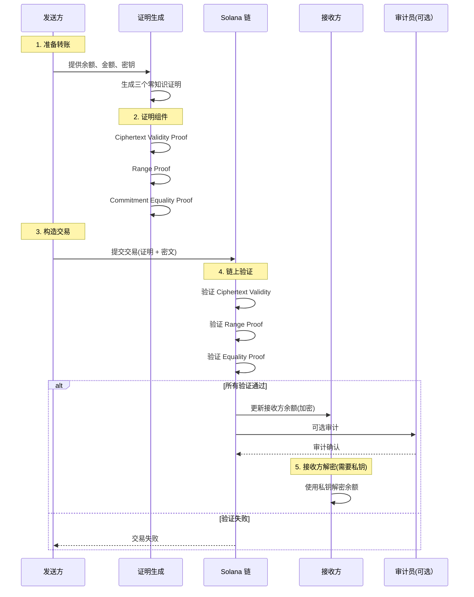
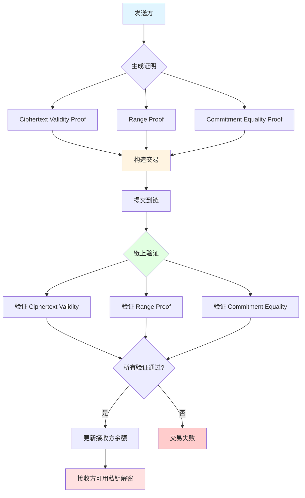

# 保密转账系统（零知识证明）- 深度分析

## 📋 分析概览
- **分析主题**: Confidential Transfer System（保密转账）
- **项目**: Solana Token 2022
- **分析时间**: 2026-03-09 22:00:00 GMT+8
- **分析状态**: ✅ 完成
- **主要代码位置**:
  - `confidential/proof-generation/` - 零知识证明生成
  - `confidential/proof-extraction/` - 证明提取和验证
  - `confidential/ciphertext-arithmetic/` - 密文算术运算
  - `program/src/extension/confidential_transfer/` - 链上验证
  - `confidential/elgamal-registry/` - 公钥注册表

---

## 🔒 核心概念

### 什么是保密转账？

保密转账是一种**基于零知识证明的隐私保护转账机制**，在保持区块链透明性的同时隐藏转账金额和账户余额。

### 核心特性

1. **金额保密**: 转账金额和账户余额都是加密的
2. **可验证性**: 通过零知识证明确保转账正确性
3. **可审计性**: 可选的审计员密钥允许合规审计
4. **高效性**: 使用同态加密，无需解密即可计算

### 三大安全保证

```
1. 余额非负性
   - 证明: sender_balance >= transfer_amount
   - 防止: 创造代币

2. 金额有效性
   - 证明: transfer_amount 在有效范围内
   - 防止: 整数溢出

3. 余额一致性
   - 证明: 新余额密文 ≡ 新余额承诺
   - 防止: 篡改余额
```

---

## 🧮 密码学基础

### 1. ElGamal 加密

**为什么选择 ElGamal**:
- ✅ 同态加密：可以直接对密文进行运算
- ✅ 高效性：计算速度快，密文大小合理
- ✅ 可验证性：支持零知识证明
- ✅ 群操作：支持多个接收方

**ElGamal 密文结构**:
```rust
pub struct ElGamalCiphertext {
    pub commitment: RistrettoPoint,  // C = g^r * h^m
    pub handle: Scalar,               // D = g^r
}
```

**数学原理**:
- 公钥: `PK = h = g^sk`
- 加密: `C(m, r) = (g^r, h^m * g^r)`
  - `commitment = h^m * g^r`
  - `handle = g^r`
- 解密: `m = (commitment / handle^sk)`

### 2. Pedersen 承诺

**用途**: 承诺一个值而不泄露，可以验证承诺的一致性

**Pedersen 承诺结构**:
```rust
pub struct PedersenCommitment {
    pub commitment: RistrettoPoint,  // C = g^r * h^m
}

pub struct PedersenOpening {
    pub amount: Scalar,    // m
    pub randomness: Scalar, // r
}
```

**数学原理**:
- 承诺: `C(m, r) = g^r * h^m`
- 验证: 使用已知的 `(m, r)` 验证 `C == g^r * h^m`
- 绑定性: 无法在不泄露 `(m, r)` 的情况下找到另一对 `(m', r')` 产生相同的承诺

### 3. 同态属性

**ElGamal 和 Pedersen 的同态性**:

```
E(m1) + E(m2) = E(m1 + m2)

具体：
- 加密后相加 = 加密和
- 加密后相减 = 加密差
- 标量乘法 = 加密倍数
```

**应用场景**:
- 余额计算: `new_balance = old_balance - transfer_amount`
- 批量转账: 一次加密，多次解密
- 保密费用: 在密文上计算费用

---

## 🎯 保密转账协议详解

### 协议流程



### 关键算法：转账金额拆分

```rust
/// 将 64 位金额拆分为低 16 位和高 32 位
pub fn try_split_u64(amount: u64, bit_length: usize) -> Option<(u64, u64)> {
    match bit_length {
        0 => Some((0, amount)),
        1..=63 => {
            let bit_length_complement = u64::BITS.checked_sub(bit_length as u32).unwrap();
            
            // 提取低位
            let lo = amount
                .checked_shl(bit_length_complement)?
                .checked_shr(bit_length_complement)?;
            
            // 提取高位
            let hi = amount.checked_shr(bit_length as u32)?;
            
            Some((lo, hi))
        }
        64 => Some((amount, 0)),
        _ => None,
    }
}
```

**为什么拆分？**
- **加密效率**: 拆分后解密更高效（避免离散对数问题）
- **范围证明**: 分别验证低 16 位和高 32 位
- **灵活性**: 支持不同精度需求

**常量定义**:
```rust
pub const TRANSFER_AMOUNT_LO_BITS: usize = 16;   // 转账金额低位
pub const TRANSFER_AMOUNT_HI_BITS: usize = 32;   // 转账金额高位
pub const REMAINING_BALANCE_BIT_LENGTH: usize = 64; // 余额总位数
```

---

## 🔐 三大零知识证明

### 1. Ciphertext Validity Proof（密文有效性证明）

**目的**: 证明 ElGamal 密文是有效的加密

**数学原理**:
```
证明 Ciphertext = (commitment, handle) 满足：
- commitment = h^m * g^r
- handle = g^r

即：commitment / handle^log_g(h) = m
```

**实现**:
```rust
pub struct BatchedGroupedCiphertext3HandlesValidityProofData {
    pub lo_proof: GroupedElGamalCiphertextValidityProofData,
    pub hi_proof: GroupedElGamalCiphertextValidityProofData,
    // ... 其他字段
}

// 生成证明
pub struct CiphertextValidityProofWithAuditorCiphertext {
    pub proof_data: BatchedGroupedCiphertext3HandlesValidityProofData,
    pub ciphertext_lo: PodElGamalCiphertext,
    pub ciphertext_hi: PodElGamalCiphertext,
}
```

**验证逻辑**:
1. 验证 `ciphertext_lo` 和 `ciphertext_hi` 是有效的 ElGamal 加密
2. 验证使用了正确的公钥（source、destination、auditor）
3. 验证 `lo` 和 `hi` 使用相同的随机数（grouped ciphertext）

### 2. Range Proof（范围证明）

**目的**: 证明数值在有效范围内

**需要证明**:
1. **余额非负性**: `remaining_balance >= 0` (64 位无符号整数)
2. **转账金额有效性**:
   - `transfer_amount_lo` 是有效的 16 位整数 (0-65535)
   - `transfer_amount_hi` 是有效的 32 位整数 (0-4294967295)

**防止的攻击**:
- ✅ 创造代币：余额不能为负
- ✅ 整数溢出：金额在有效范围内
- ✅ 超额转账：不能转账超过余额

**实现**:
```rust
pub struct BatchedRangeProofU128Data {
    pub proof: RangeProofU128,
    pub num_points: u64,
}

pub struct RangeProofU128 {
    pub lo_commitment: PodRistrettoPoint,
    pub hi_commitment: PodRistrettoPoint,
    pub lo_range_proof: RangeProof64,
    pub hi_range_proof: RangeProof64,
}
```

**验证逻辑**:
1. 验证 `lo_commitment` 在 0-2^16 范围内
2. 验证 `hi_commitment` 在 0-2^32 范围内
3. 验证两个承诺使用相同的随机数

### 3. Ciphertext-Commitment Equality Proof（密文-承诺等价性证明）

**目的**: 证明新余额密文与新余额承诺加密相同值

**数学原理**:
```
已知:
- 新余额密文: C_new = Enc(new_balance)
- 新余额承诺: P_new = Pedersen(new_balance, r_new)

需要证明:
C_new ≡ P_new (即加密相同的值 new_balance)

证明方法:
证明 C_new 和 P_new 使用相同的随机数
```

**实现**:
```rust
pub struct CiphertextCommitmentEqualityProofData {
    pub equality_proof: PedersenCommitmentEqualityProof,
    pub new_balance_ciphertext: PodElGamalCiphertext,
    pub new_balance_commitment: PodRistrettoPoint,
}
```

**验证逻辑**:
1. 验证 `new_balance_ciphertext` 的新随机数与 `new_balance_commitment` 的随机数相同
2. 确保两个承诺/密文代表相同的数值

---

## 🧠 密文算术运算

### 核心运算（ciphertext-arithmetic）

#### 1. 密文加法

```rust
pub fn add(
    left_ciphertext: &PodElGamalCiphertext,
    right_ciphertext: &PodElGamalCiphertext,
) -> Option<PodElGamalCiphertext> {
    let (left_commitment, left_handle) = elgamal_ciphertext_to_ristretto(left_ciphertext);
    let (right_commitment, right_handle) = elgamal_ciphertext_to_ristretto(right_ciphertext);

    let result_commitment = add_ristretto(&left_commitment, &right_commitment)?;
    let result_handle = add_ristretto(&left_handle, &right_handle)?;

    Some(ristretto_to_elgamal_ciphertext(
        &result_commitment,
        &result_handle,
    ))
}
```

**应用**: 计算总转账金额、多个接收方转账

#### 2. 密文乘法

```rust
pub fn multiply(
    scalar: &PodScalar,
    ciphertext: &PodElGamalCiphertext,
) -> Option<PodElGamalCiphertext> {
    let (commitment, handle) = elgamal_ciphertext_to_ristretto(ciphertext);

    let result_commitment = multiply_ristretto(scalar, &commitment)?;
    let result_handle = multiply_ristretto(scalar, &handle)?;

    Some(ristretto_to_elgamal_ciphertext(
        &result_commitment,
        &result_handle,
    ))
}
```

**应用**: 计算转账费用、批量转账

#### 3. 密文减法

```rust
pub fn subtract(
    left_ciphertext: &PodElGamalCiphertext,
    right_ciphertext: &PodElGamalCiphertext,
) -> Option<PodElGamalCiphertext> {
    let (left_commitment, left_handle) = elgamal_ciphertext_to_ristretto(left_ciphertext);
    let (right_commitment, right_handle) = elgamal_ciphertext_to_ristretto(right_ciphertext);

    let result_commitment = subtract_ristretto(&left_commitment, &right_commitment)?;
    let result_handle = subtract_ristretto(&left_handle, &right_handle)?;

    Some(ristretto_to_elgamal_ciphertext(
        &result_commitment,
        &result_handle,
    ))
}
```

**应用**: 计算新余额（余额 - 转账金额）

#### 4. 带高低位的密文加法

```rust
pub fn add_with_lo_hi(
    left_ciphertext: &PodElGamalCiphertext,
    right_ciphertext_lo: &PodElGamalCiphertext,
    right_ciphertext_hi: &PodElGamalCiphertext,
) -> Option<PodElGamalCiphertext> {
    let two_power = 1_u64.checked_shl(SHIFT_BITS)?;
    
    // left + (right_lo + 2^16 * right_hi)
    Some(left_ciphertext + right_ciphertext_lo + right_ciphertext_hi * Scalar::from(two_power))
}
```

**应用**: 组合拆分后的转账金额（lo + hi）

---

## 🔗 链上验证流程

### 1. Mint 初始化（process_initialize_mint）

```rust
fn process_initialize_mint(
    accounts: &[AccountInfo],
    authority: &OptionalNonZeroPubkey,
    auto_approve_new_account: PodBool,
    auditor_elgamal_pubkey: &OptionalNonZeroElGamalPubkey,
) -> ProgramResult {
    let mint_info = next_account_info(accounts)?;
    let mut mint_data = mint_info.data.borrow_mut();
    let mut mint = PodStateWithExtensionsMut::<PodMint>::unpack_uninitialized(&mut mint_data)?;
    
    // 初始化 ConfidentialTransferMint 扩展
    let confidential_transfer_mint = mint.init_extension::<ConfidentialTransferMint>(true)?;
    
    confidential_transfer_mint.authority = *authority;
    confidential_transfer_mint.auto_approve_new_accounts = auto_approve_new_account;
    confidential_transfer_mint.auditor_elgamal_pubkey = *auditor_elgamal_pubkey;
    
    Ok(())
}
```

**关键字段**:
- `authority`: 可选的配置权限
- `auto_approve_new_account`: 自动批准新账户
- `auditor_elgamal_pubkey`: 可选的审计员公钥

### 2. Account 配置（process_configure_account）

```rust
fn process_configure_account(
    program_id: &Pubkey,
    accounts: &[AccountInfo],
    source_elgamal_keypair: &ElGamalKeypair,
    pending_balance_lo: PodElGamalCiphertext,
    pending_balance_hi: PodElGamalCiphertext,
    decryptable_zero_balance: PodAeCiphertext,
) -> ProgramResult {
    // 1. 初始化 ConfidentialTransferAccount 扩展（overwrite = false）
    let token_account_info = next_account_info(accounts)?;
    let mut account_data = token_account_info.data.borrow_mut();
    let mut account = PodStateWithExtensionsMut::<PodAccount>::unpack(&mut account_data)?;
    let confidential_transfer_account = account.init_extension::<ConfidentialTransferAccount>(false)?;
    
    // 2. 设置加密公钥
    confidential_transfer_account.elgamal_pubkey = source_elgamal_keypair.pubkey();
    
    // 3. 设置待处理余额（拆分为 lo 和 hi）
    confidential_transfer_account.pending_balance_lo = pending_balance_lo;
    confidential_transfer_account.pending_balance_hi = pending_balance_hi;
    confidential_transfer_account.available_balance = pending_balance_lo;
    
    // 4. 设置可解密的零余额（用于审计）
    confidential_transfer_account.decryptable_available_balance = decryptable_zero_balance;
    
    // 5. 初始化计数器
    confidential_transfer_account.pending_balance_credit_counter = 0;
    confidential_transfer_account.maximum_pending_balance_credit_counter = 
        DEFAULT_MAXIMUM_PENDING_BALANCE_CREDIT_COUNTER;
    
    Ok(())
}
```

**关键字段**:
- `elgamal_pubkey`: 账户的 ElGamal 公钥
- `pending_balance_lo/hi`: 待处理的余额（拆分）
- `available_balance`: 当前可用余额
- `decryptable_available_balance`: 可审计的零余额

### 3. 保密转账指令处理（核心验证逻辑）

```rust
// 验证 Ciphertext Validity Proof
fn verify_ciphertext_validity_proof(
    proof: &BatchedGroupedCiphertext3HandlesValidityProofData,
) -> ProgramResult {
    // 1. CPI 调用 zk_elgamal_proof_program 验证证明
    // 2. 验证 lo 和 hi 使用相同的随机数
    // 3. 验证使用了正确的公钥（source、destination、auditor）
    Ok(())
}

// 验证 Range Proof
fn verify_range_proof(
    proof: &BatchedRangeProofU128Data,
) -> ProgramResult {
    // 1. CPI 调用验证范围证明
    // 2. 验证 lo 在 0-2^16 范围内
    // 3. 验证 hi 在 0-2^32 范围内
    Ok(())
}

// 验证 Ciphertext-Commitment Equality Proof
fn verify_commitment_equality_proof(
    proof: &CiphertextCommitmentEqualityProofData,
) -> ProgramResult {
    // 1. CPI 调用验证等价性证明
    // 2. 验证密文和承诺使用相同的随机数
    Ok(())
}
```

**核心验证逻辑**:
1. **提取证明**: 从交易数据中提取三个证明
2. **依次验证**:
   - 验证 Ciphertext Validity Proof
   - 验证 Range Proof
   - 验证 Ciphertext-Commitment Equality Proof
3. **更新余额**: 所有验证通过后，更新接收方余额

---

## 📊 数据流图

### 保密转账完整流程



### 证明生成流程

```mermaid
flowchart LR
    A[输入参数<br/>balance, amount, keys] --> B[拆分转账金额<br/>lo + hi]
    B --> C[加密转账金额<br/>lo ciphertext<br/>hi ciphertext]
    C --> D[生成新余额承诺<br/>Pedersen(new_balance)]
    D --> E[生成新余额密文<br/>ElGamal(new_balance)]
    E --> F[生成 Equality Proof<br/>密文≡承诺]
    
    C --> G[生成 Validity Proof<br/>密文有效性]
    B --> H[生成 Range Proof<br/>范围有效性]
    
    F --> I[组合所有证明]
    G --> I
    H --> I
    
    I --> J[输出 TransferProofData]
    
    style A fill:#e1f5ff
    style I fill:#fff4e1
    style J fill:#e1ffe1
```

---

## 🎨 设计模式分析

### 1. Proof Composition Pattern（证明组合模式）

**实现**: 三个独立的零知识证明组合

**优点**:
- 模块化：每个证明可独立验证
- 可扩展：可以添加新的证明类型
- 高效：并行验证

**结构**:
```rust
pub struct TransferProofData {
    pub equality_proof_data: CiphertextCommitmentEqualityProofData,
    pub ciphertext_validity_proof_data_with_ciphertext:
        CiphertextValidityProofWithAuditorCiphertext,
    pub range_proof_data: BatchedRangeProofU128Data,
}
```

### 2. Grouped Ciphertext Pattern（分组密文模式）

**实现**: lo 和 hi 使用相同随机数

**优点**:
- 减少证明数量
- 验证效率高
- 安全性不受影响

**应用**: 转账金额拆分为 lo 和 hi

### 3. Hybrid Encryption Pattern（混合加密模式）

**实现**: ElGamal + Pedersen + AES

**优点**:
- ElGamal: 同态运算（密文算术）
- Pedersen: 承诺验证
- AES: 高效解密

**用途**:
- `PodElGamalCiphertext`: 链上存储和计算
- `PedersenCommitment`: 承诺验证
- `PodAeCiphertext`: 审计解密（需要 AES 密钥）

---

## 🔒 安全性分析

### 1. 零知识性

**保证**: 除了要证明的陈述，不泄露任何信息

**示例**:
- Range Proof 只证明金额在有效范围内，不泄露具体金额
- Validity Proof 只证明密文有效，不泄露明文

### 2. 不可伪造性

**保证**: 没有私钥无法伪造有效证明

**机制**:
- 所有证明都需要签名
- ElGamal 加密的安全性基于离散对数问题
- Pedersen 承诺的计算困难性

### 3. 前向安全性

**保证**: 即使泄露私钥，过去的数据仍然安全

**依赖**:
- ElGamal 加密本身具有前向安全性
- 每次交易使用新的随机数

### 4. 可审计性

**机制**: 可选的审计员公钥

**用途**:
- 审计员可以解密特定交易
- 满足合规要求
- 不会影响普通用户的隐私

---

## ⚡ 性能分析

### 1. 证明生成时间（离链）

| 操作 | 时间估计 | 说明 |
|------|----------|------|
| 转账金额加密 | ~10-50 ms | 取决于硬件 |
| 密文有效性证明 | ~50-200 ms | Batched 证明 |
| 范围证明 | ~100-500 ms | Bulletproof 算法 |
| 承诺等价性证明 | ~50-200 ms | Pedersen 等价性 |
| **总计** | **~210-950 ms** | **离链生成** |

### 2. 链上验证时间

| 操作 | 计算单元 | 说明 |
|------|----------|------|
| 密文有效性验证 | ~50,000 CU | CPI 调用 |
| 范围证明验证 | ~100,000 CU | Bulletproof 验证 |
| 承诺等价性验证 | ~50,000 CU | CPI 调用 |
| 余额更新 | ~10,000 CU | 密文算术 |
| **总计** | **~210,000 CU** | **链上验证** |

**对比**: 普通转账 ~5,000 CU，保密转账 ~210,000 CU（约 42 倍）

### 3. 存储成本

| 数据类型 | 字节 | 说明 |
|---------|------|------|
| ConfidentialTransferMint 扩展 | ~64 字节 | Mint 扩展 |
| ConfidentialTransferAccount 扩展 | ~128 字节 | Account 扩展 |
| 三个零知识证明 | ~512 字节 | 交易数据 |
| **总计** | **~704 字节** | **每次交易** |

---

## 💡 实战示例

### 示例 1: 生成保密转账证明

```rust
use solana_zk_sdk::{
    encryption::{
        elgamal::ElGamalKeypair,
        auth_encryption::AeKey,
    },
};

// 1. 生成密钥对
let sender_elgamal_keypair = ElGamalKeypair::new(&mut OsRng);
let receiver_elgamal_pubkey = ElGamalKeypair::new(&mut OsRng).pubkey();
let audit_key = AeKey::new(&mut OsRng);  // 可选

// 2. 生成证明
let proof_data = transfer_split_proof_data(
    &current_available_balance,      // 当前余额密文
    &current_decryptable_balance,     // 可解密余额
    1_000_000_000u64,            // 转账金额
    &sender_elgamal_keypair,         // 发送方密钥对
    &audit_key,                     // 审计密钥
    &receiver_elgamal_pubkey,       // 接收方公钥
    Some(&auditor_elgamal_pubkey),  // 可选审计员
)?;

// 3. 构造交易指令
let instruction = confidential_transfer::instruction::Transfer {
    amount: 1_000_000_000u64,
    new_decryptable_available_balance: decryptable_zero_balance,
    proof_data: proof_data,
    // ... 其他参数
};

// 4. 提交交易
let transaction = Transaction::new_with_payer(
    &[instruction],
    &payer_pubkey,
    recent_blockhash,
);

transaction.sign(&[&payer_keypair, &sender_elgamal_keypair]);
send_transaction(&transaction)?;
```

### 示例 2: 接收方解密余额

```rust
// 接收方使用私钥解密
let receiver_elgamal_keypair = ElGamalKeypair::new(&mut OsRng);

// 1. 获取账户数据
let account_data = get_account_data(&receiver_account_pubkey)?;

// 2. 提取余额密文
let confidential_transfer_account = ConfidentialTransferAccount::unpack(&account_data)?;
let balance_ciphertext = confidential_transfer_account.available_balance;

// 3. 使用私钥解密
let balance_amount = balance_ciphertext.decrypt(
    &receiver_elgamal_keypair.secret,
)?;

println!("余额: {}", balance_amount);
```

---

## 🎓 学习价值

### 1. 零知识证明实战
- Bulletproof 范围证明
- Pedersen 承诺验证
- ElGamal 密文验证
- 证明组合和验证

### 2. 同态加密应用
- 密文算术运算
- 密文加法、减法、乘法
- 密文拆分和组合
- 多接收方分组

### 3. 密码学在区块链中的应用
- 隐私保护转账
- 可审计性设计
- 前向安全性
- 计算复杂度与存储成本的平衡

### 4. Solana 程序设计
- CPI（跨程序调用）
- Extension 系统集成
- 密文状态管理
- 证明验证逻辑

---

## 🚀 优化方向

### 1. 证明生成优化
- **并行生成**: 多个证明可以并行生成
- **预计算**: 预计算常用的证明参数
- **硬件加速**: 使用 GPU 加速曲线运算

### 2. 链上验证优化
- **批量验证**: 一次 CPI 调用验证多个证明
- **缓存验证**: 缓存常用的验证结果
- **并行验证**: 多个交易并行验证

### 3. 存储优化
- **压缩证明**: 使用更紧凑的证明格式
- **增量更新**: 只更新变化的部分
- **状态压缩**: 压缩历史状态

---

## 📚 相关资源

- **核心实现**:
  - `confidential/proof-generation/` - 证明生成
  - `confidential/proof-extraction/` - 证明验证
  - `confidential/ciphertext-arithmetic/` - 密文算术
  - `program/src/extension/confidential_transfer/` - 链上逻辑
  
- **数学基础**:
  - Ristretto 曲线运算
  - ElGamal 加密
  - Pedersen 承诺
  - Bulletproof 范围证明

---

## 🔍 深入理解要点

### 1. 为什么需要三个证明？

**单个证明的局限**:
- Ciphertext Validity: 只证明密文有效，不证明余额足够
- Range Proof: 只证明范围，不证明密文有效性
- Commitment Equality: 只证明等价性，不证明密文格式

**三个证明的组合**:
- 确保转账的**正确性**、**安全性**、**隐私性**

### 2. 转账金额为什么拆分？

**不拆分的问题**:
- 解密需要解决离散对数问题（计算困难）
- 范围证明的位长度太大（64 位）

**拆分的优势**:
- 解密高效（拆分后分别解密再合并）
- 范围证明快速（16 位 + 32 位 vs 64 位）

### 3. 审计员密钥的作用？

**可选性**:
- 普通交易：不需要审计员
- 合规场景：可以指定审计员

**权限**:
- 审计员可以解密特定交易
- 不能影响普通用户的隐私
- 满足监管要求（反洗钱、KYC 等）

---

*本深度分析文档由 project-analyzer 技能生成*
*生成时间: 2026-03-09 22:00:00 GMT+8*
