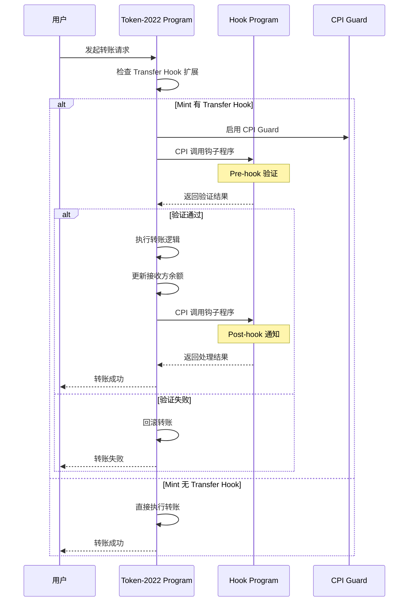

# Transfer Hook 系统深度分析

## 📋 分析概览
- **分析主题**: Transfer Hook System
- **项目**: Solana Token 2022
- **分析时间**: 2026-03-09 23:00:00 GMT+8
- **分析状态**: ✅ 完成
- **主要代码位置**:
  - `program/src/extension/transfer_hook/processor.rs`
  - `interface/src/extension/transfer_hook/mod.rs`

---

## 🎯 核心概念

### 什么是 Transfer Hook？

Transfer Hook 是一个**强大的扩展系统**，允许外部程序在转账过程中介入，实现自定义逻辑。

### 核心特性

1. **外部程序集成**: 允许调用任何 Solana 程序
2. **前置/后置钩子**: 在转账前后执行自定义逻辑
3. **参数传递**: 可以传递自定义数据到钩子程序
4. **原子性保证**: 钩子执行失败会回滚整个转账
5. **CPI 安全**: 防止恶意 CPI 调用

### 应用场景

- **Whitelist 检查**: 验证接收方是否在白名单中
- **KYC 验证**: 确认用户已完成 KYC
- **限额控制**: 实施转账限额或冷却时间
- **自定义转账逻辑**: 根据业务规则批准/拒绝转账
- **跨链桥接**: 在不同链之间安全转账
- **税收/手续费**: 执行自定义税务逻辑

---

## 🏗️ 系统架构

### 数据结构

```rust
// Mint 扩展
pub struct TransferHook {
    pub program_id: OptionalNonZeroPubkey,  // 钩子程序 ID
    pub authority: OptionalNonZeroPubkey,   // 配置权限
}

// Account 扩展
pub struct TransferHookAccount {
    pub transferring: bool,  // 是否正在转账中
}
```

### 指令类型

```rust
pub enum TransferHookInstruction {
    /// 初始化 Mint 的 Transfer Hook
    Initialize,
    /// 更新 Mint 的 Transfer Hook 程序 ID
    Update,
}
```

---

## 🔄 工作流程

### 完整的转账流程（带 Hook）



### 核心流程步骤

1. **初始化阶段**:
   ```
   Mint 配置
     ↓
   初始化 TransferHook 扩展
     ↓
   设置钩子程序 ID 和权限
   ```

2. **转账阶段**:
   ```
   用户发起转账
     ↓
   Token-2022 检查扩展
     ↓
   如果存在 TransferHook 扩展:
     ├─ 启用 CPI Guard
     ├─ CPI 调用钩子程序
     ├─ 验证钩子返回结果
     ├─ 执行或中止转账
     └─ 可选：后置钩子调用
   ```

3. **清理阶段**:
   ```
   使用 `set_transferring(false)` 或 `unset_transferring()`
     ↓
   清除转账状态
   ```

---

## 🔧 核心实现

### 1. 初始化 Mint 的 Transfer Hook

```rust
fn process_initialize(
    program_id: &Pubkey,
    accounts: &[AccountInfo],
    authority: &OptionalNonZeroPubkey,
    transfer_hook_program_id: &OptionalNonZeroPubkey,
) -> ProgramResult {
    let mint_account_info = next_account_info(accounts)?;
    let mut mint_data = mint_account_info.data.borrow_mut();
    let mut mint = PodStateWithExtensionsMut::<PodMint>::unpack_uninitialized(&mut mint_data)?;
    
    // 初始化 TransferHook 扩展（overwrite = true）
    let extension = mint.init_extension::<TransferHook>(true)?;
    
    extension.authority = *authority;
    
    // 验证：至少要有 authority 或 program_id
    if let Some(transfer_hook_program_id) = Option::<Pubkey>::from(*transfer_hook_program_id) {
        if transfer_hook_program_id == *program_id {
            return Err(ProgramError::IncorrectProgramId);
        }
    } else if Option::<Pubkey>::from(*authority).is_none() {
        msg!("Transfer hook extension requires at least an authority or a program id");
        return Err(TokenError::InvalidInstruction)?;
    }
    
    extension.program_id = *transfer_hook_program_id;
    Ok(())
}
```

**关键验证**:
- ❌ 钩子程序 ID 不能等于当前程序 ID（防止递归）
- ❌ 至少要有 `authority` 或 `program_id`
- ✅ `overwrite = true`（Mint 扩展）

### 2. 更新钩子程序 ID

```rust
fn process_update(
    program_id: &Pubkey,
    accounts: &[AccountInfo],
    new_program_id: &OptionalNonZeroPubkey,
) -> ProgramResult {
    let mint_account_info = next_account_info(accounts)?;
    let owner_info = next_account_info(accounts)?;
    
    let mut mint_data = mint_account_info.data.borrow_mut();
    let mut mint = PodStateWithExtensionsMut::<PodMint>::unpack(&mut mint_data)?;
    let extension = mint.get_extension_mut::<TransferHook>()?;
    
    // 验证权限
    let authority = Option::<Pubkey>::from(extension.authority)
        .ok_or(TokenError::NoAuthorityExists)?;
    
    Processor::validate_owner(
        program_id,
        &authority,
        owner_info,
        owner_info.data_len(),
        account_info_iter.as_slice(),
    )?;
    
    // 验证：新程序 ID 不能等于当前程序 ID
    if let Some(new_program_id) = Option::<Pubkey>::from(*new_program_id) {
        if new_program_id == *program_id {
            return Err(ProgramError::IncorrectProgramId);
        }
    }
    
    extension.program_id = *new_program_id;
    Ok(())
}
```

**关键验证**:
- ❌ 权限验证（签名者必须匹配 authority）
- ❌ 不能更新为当前程序 ID
- ✅ 允许更改为其他程序 ID

### 3. 转账时的 Hook 调用

```rust
// 在 processor.rs 的转账指令中
fn process_transfer(
    // ... 其他参数
) -> ProgramResult {
    // 1. 解包 Mint 数据
    let mint = PodStateWithExtensions::<PodMint>::unpack(mint_data)?;
    
    // 2. 检查 TransferHook 扩展
    if let Ok(transfer_hook) = mint.get_extension::<TransferHook>() {
        // 3. 调用钩子程序
        invoke_transfer_hook(
            &transfer_hook.program_id,
            accounts,
            amount,
            // ... 其他参数
        )?;
    }
    
    // 4. 继续正常的转账逻辑
    // ...
}
```

---

## 🔒 安全机制

### 1. CPI Guard 防护

**目的**: 防止恶意程序通过 CPI 调用绕过钩子验证

**实现**:
```rust
// 在 CpiGuard 扩展中
pub struct CpiGuard {
    pub enable: bool,  // 是否启用 CPI Guard
}

// 在转账开始时
set_transferring(&mut token_account_data)?;

// 在 CPI Guard 启用时
in_cpi(&mut token_account_data)?;

// 转账完成后
unset_transferring(&mut token_account_data)?;
```

**防护逻辑**:
```
如果 CpiGuard 启用:
  • 账户在转账中（transferring = true）
  • 尝试进行 CPI 调用
  • 拒绝调用（错误：CpiGuardViolation）

如果 CpiGuard 未启用:
  • 允许正常的 CPI 调用
```

### 2. 递归防护

**验证**: 钩子程序 ID 不能等于当前程序 ID

```rust
if transfer_hook_program_id == *program_id {
    return Err(ProgramError::IncorrectProgramId);
}
```

**目的**: 防止无限递归调用

### 3. 权限控制

**两层权限**:
1. **authority**: 可以更新钩子程序 ID
2. **钩子程序本身**: 在转账时被调用

**权限验证**:
- 更新钩子: 需要 authority 签名
- 使用钩子: 自动调用（无需额外权限）

### 4. 原子性保证

**Solana 的原子性机制**:
- 所有 CPI 调用在同一交易中
- 任何步骤失败，整个交易回滚
- 状态一致性得到保证

**示例**:
```
交易步骤:
1. CPI 调用钩子程序
2. 验证通过 ✓
3. 执行转账
4. 步骤 4 失败 ✗
5. 整个交易回滚
```

---

## 💡 实战示例

### 示例 1: 实现 Whitelist 钩子

```rust
use solana_program::{
    account_info::{next_account_info, AccountInfo},
    entrypoint::ProgramResult,
    program_error::ProgramError,
    pubkey::Pubkey,
    msg,
};

#[cfg(not(feature = "no-entrypoint"))]
solana_program::entrypoint!(process_instruction);

/// Whitelist 钩子程序
pub fn process_instruction(
    program_id: &Pubkey,
    accounts: &[AccountInfo],
    instruction_data: &[u8],
) -> ProgramResult {
    msg!("Whitelist Hook: Processing transfer");
    
    let accounts_iter = &mut accounts.iter();
    let whitelist_account = next_account_info(accounts_iter)?;
    let recipient = next_account_info(accounts_iter)?;
    
    // 检查接收方是否在白名单中
    let whitelist_data = &whitelist_account.data.borrow();
    let recipient_key = recipient.key.as_ref();
    
    if !whitelist_data.contains(recipient_key) {
        msg!("Recipient not in whitelist");
        return Err(ProgramError::Custom(1));
    }
    
    msg!("Recipient approved in whitelist");
    Ok(())
}

// Whitelist 账户数据格式
// [Pubkey1][Pubkey2][Pubkey3]...
// 每个 Pubkey 32 字节
```

**使用方法**:
```rust
// 1. 创建 Whitelist 程序
let whitelist_program_id = "WhitelistProgramPublicKey...";

// 2. 初始化 Mint 的 Transfer Hook
initialize_mint_with_transfer_hook(
    mint_pubkey,
    authority,
    whitelist_program_id,  // 设置钩子程序
)?;

// 3. 发起转账
transfer_with_hook(
    from,
    to,
    amount,
    // ... 钩子会自动调用 Whitelist 程序
)?;
```

### 示例 2: 实现 KYC 验证钩子

```rust
pub fn process_kyc_check(
    accounts: &[AccountInfo],
    user_data: &[u8],
) -> ProgramResult {
    msg!("KYC Hook: Checking user KYC status");
    
    let accounts_iter = &mut accounts.iter();
    let kyc_registry = next_account_info(accounts_iter)?;
    let user_account = next_account_info(accounts_iter)?;
    
    // 检查用户的 KYC 状态
    let kyc_data = &kyc_registry.data.borrow();
    let user_key = user_account.key.as_ref();
    
    let kyc_status = get_kyc_status(kyc_data, user_key);
    
    match kyc_status {
        KYCStatus::Verified => {
            msg!("User KYC verified, allowing transfer");
            Ok(())
        }
        KYCStatus::Pending => {
            msg!("User KYC pending, blocking transfer");
            Err(ProgramError::Custom(2))
        }
        KYCStatus::Rejected => {
            msg!("User KYC rejected, blocking transfer");
            Err(ProgramError::Custom(3))
        }
    }
}

enum KYCStatus {
    Verified,
    Pending,
    Rejected,
}
```

### 示例 3: 实现限额控制钩子

```rust
pub struct TransferLimit {
    pub daily_limit: u64,
    pub daily_transferred: u64,
    pub last_transfer_time: i64,
}

pub fn process_limit_check(
    limit_account: &AccountInfo,
    amount: u64,
    current_timestamp: i64,
) -> ProgramResult {
    msg!("Limit Hook: Checking transfer limits");
    
    let mut limit_data = limit_account.data.borrow_mut();
    let transfer_limit = TransferLimit::unpack(&mut limit_data)?;
    
    // 检查是否是新的一天
    let is_new_day = current_timestamp - transfer_limit.last_transfer_time > 86400; // 24 小时
    
    if is_new_day {
        // 新的一天，重置限额
        transfer_limit.daily_transferred = 0;
    }
    
    // 检查是否超过日限额
    let new_total = transfer_limit.daily_transferred.checked_add(amount)
        .ok_or(ProgramError::Custom(4))?;
    
    if new_total > transfer_limit.daily_limit {
        msg!("Daily transfer limit exceeded");
        return Err(ProgramError::Custom(5));
    }
    
    // 更新已转账金额
    transfer_limit.daily_transferred = new_total;
    transfer_limit.last_transfer_time = current_timestamp;
    
    transfer_limit.pack(&mut limit_data);
    
    msg!("Transfer within limits, allowing");
    Ok(())
}
```

---

## 📊 性能分析

### CPI 调用成本

| 操作 | 计算单元 | 说明 |
|------|-----------|------|
| CPI 调用钩子程序 | ~5,000 - 20,000 CU | 取决于钩子程序复杂度 |
| 钩子程序执行 | ~10,000 - 50,000 CU | 取决于验证逻辑 |
| 状态更新 | ~1,000 - 5,000 CU | `transferring` 标志 |
| **总计** | **~16,000 - 75,000 CU** | **额外开销** |

### 存储成本

| 数据 | 字节 | 说明 |
|------|------|------|
| TransferHook 扩展 | 34 字节 | Mint 扩展 |
| TransferHookAccount 扩展 | 1 字节 | Account 扩展 |
| **总计** | **35 字节** | **每次使用 Hook** |

### 与普通转账对比

```
普通转账: ~5,000 CU
Transfer Hook 转账: ~21,000 - 80,000 CU
增加比例: 约 3-6 倍
```

**权衡**:
- ✅ 功能灵活性极大提升
- ❌ 链上成本显著增加
- 建议：仅在需要自定义逻辑时使用

---

## 🎨 设计模式分析

### 1. Hook Pattern（钩子模式）

**实现**: 通过扩展 + CPI 调用

**优点**:
- ✅ 高度可扩展
- ✅ 不修改核心程序
- ✅ 外部程序独立升级

**缺点**:
- ❌ CPI 开销较大
- ❌ 调试复杂度高
- ❌ 依赖外部程序的可靠性

### 2. Guard Pattern（守卫模式）

**实现**: CpiGuard 扩展

**优点**:
- ✅ 安全性高
- ✅ 防止恶意 CPI
- ✅ 细粒度控制

**应用场景**:
- 保护转账中的账户
- 防止未经授权的 CPI
- 实施业务规则

### 3. Factory Pattern（工厂模式）

**实现**: 根据配置动态调用不同钩子程序

**优点**:
- ✅ 支持多个钩子程序
- ✅ 动态切换
- ✅ 测试方便

**示例**:
```rust
let hook_program_id = get_hook_program_id(&mint)?;
match hook_program_id {
    WHITELIST_ID => invoke_whitelist_hook(),
    KYC_ID => invoke_kyc_hook(),
    LIMIT_ID => invoke_limit_hook(),
    _ => Ok(()), // 无钩子
}
```

---

## 🔒 安全性深度分析

### 1. CPI Guard 的重要性

**攻击场景**: 恶意程序尝试绕过钩子验证

**防护机制**:
```
正常流程:
用户 → Token-2022 → 钩子程序 → 验证 → 继续

攻击尝试:
用户 → Token-2022 → 恶意程序 → 伪造验证 → CPI 调用
         ↑
     被拦截！
```

**CPI Guard 检测**:
- 账户状态：`transferring == true`
- CPI 调用：触发检查
- 结果：拒绝未授权的 CPI

### 2. 递归防护

**攻击场景**: 钩子程序 ID 设置为 Token-2022

**防护机制**:
```rust
if transfer_hook_program_id == *program_id {
    return Err(ProgramError::IncorrectProgramId);
}
```

**原因**: 防止无限递归调用（Token-2022 → Token-2022 → Token-2022 ...）

### 3. 权限验证的重要性

**两层权限**:

**第一层**: 更新钩子配置
- 需要 `authority` 签名
- 防止未授权的钩子设置

**第二层**: 钩子程序执行
- 自动调用，无需额外权限
- 通过程序 ID 授权

**示例**:
```
攻击者尝试:
1. 设置钩子为恶意程序
2. 调用转账
3. 恶意程序执行

防护:
1. 更新钩子需要 authority 签名 ✅
2. 恶意程序可以执行 ❌（但 authority 受限）
```

### 4. 原子性保证

**Solana 的原子性**:
```
交易步骤:
1. CPI 调用钩子 → 成功
2. 执行转账 → 成功
3. 更新余额 → 失败！
4. 整个交易回滚 ✅
```

**保证**:
- 状态一致性
- 不会出现部分更新
- 用户资金安全

---

## 💡 最佳实践

### 1. 钩子程序设计

**推荐原则**:
- ✅ 快速验证（< 50,000 CU）
- ✅ 明确的错误码
- ✅ 详细日志记录
- ✅ 可测试性高
- ❌ 避免复杂的状态操作

**反模式**:
- ❌ 在钩子中进行复杂计算
- ❌ 依赖外部网络调用
- ❌ 使用多个状态账户

### 2. 错误处理

**错误码设计**:
```rust
pub enum HookError {
    // 验证错误
    RecipientNotAllowed = 1,
    KYCPending = 2,
    KYCRejected = 3,
    
    // 限额错误
    DailyLimitExceeded = 4,
    
    // 系统错误
    InvalidData = 100,
}
```

**错误传播**:
```rust
// 钩子程序返回错误
Err(HookError::RecipientNotAllowed)

// Token-2022 转换为标准错误
// CPI 调用失败，整个交易回滚
```

### 3. 测试策略

**单元测试**:
- 测试所有验证逻辑
- 测试边界情况
- 测试错误处理

**集成测试**:
- 测试与 Token-2022 的集成
- 测试 CPI 调用
- 测试原子性回滚

**E2E 测试**:
- 完整的转账流程
- 多种钩子场景
- 错误恢复

---

## 🚀 优化方向

### 1. 减少 CPI 开销

**策略**:
- 使用轻量级钩子程序
- 批量验证（如果可能）
- 缓存验证结果

**示例**:
```rust
// 不好的做法：每个账户单独调用
for recipient in recipients {
    invoke_hook(recipient)?;
}

// 好的做法：批量验证
invoke_batch_hook(recipients)?;
```

### 2. 并行验证

**策略**: 使用多个账户并行验证

**示例**:
```rust
// 验证多个条件
let whitelist_ok = verify_whitelist(recipient)?;
let kyc_ok = verify_kyc(sender)?;
let limit_ok = verify_limits(amount)?;

if whitelist_ok && kyc_ok && limit_ok {
    Ok(())
} else {
    Err(...)
}
```

### 3. 预计算优化

**策略**: 预计算常用的验证结果

**示例**:
```rust
// 预计算白名单的哈希
let whitelist_hash = compute_whitelist_hash();

// 快速检查
if whitelist_hash.contains(recipient_hash) {
    Ok(())
}
```

---

## 📚 学习价值

### 1. 外部程序集成

- CPI 调用机制
- 程序间通信
- 账户权限管理
- 数据传递

### 2. 钩子系统设计

- 预留点设计
- 事件驱动架构
- 插件系统模式
- 解耦合设计

### 3. 安全设计

- 防护模式应用
- 递归防护
- 原子性保证
- 权限控制

### 4. 性能优化

- CPI 开销优化
- 批量操作
- 并行验证
- 预计算策略

---

## 📈 适用场景矩阵

| 场景 | 适用性 | 钩子类型 | 复杂度 |
|------|--------|----------|---------|
| Whitelist | ⭐⭐⭐⭐ | 前置钩子 | 低 |
| KYC 验证 | ⭐⭐⭐⭐ | 前置钩子 | 中 |
| 限额控制 | ⭐⭐⭐⭐ | 前置钩子 | 中 |
| 税收/手续费 | ⭐⭐⭐⭐ | 前置钩子 | 低 |
| 跨链桥接 | ⭐⭐⭐⭐ | 前置/后置钩子 | 高 |
| 自定义业务逻辑 | ⭐⭐⭐⭐ | 前置/后置钩子 | 高 |

---

## 🔗 相关资源

- **核心实现**:
  - `program/src/extension/transfer_hook/processor.rs`
  - `interface/src/extension/transfer_hook/mod.rs`
  - `program/src/extension/cpi_guard/mod.rs`

- **相关扩展**:
  - CPI Guard - 防护机制
  - Memo Transfer - 备注传递

---

## 🔍 深入理解要点

### 1. 为什么需要两个扩展？

```
TransferHook (Mint) - 配置钩子程序
TransferHookAccount (Account) - 转账状态
```

**原因**:
- Mint 级别：所有账户共享同一个钩子
- Account 级别：独立控制单个账户的转账状态

### 2. CPI Guard 的触发时机

```
转账开始: set_transferring(true)
CPI 调用中: in_cpi() - 检查 transferring 状态
转账完成: unset_transferring()
```

**关键点**:
- `transferring == true` 时拒绝 CPI
- `transferring == false` 时允许 CPI
- 确保只有 Token-2022 可以在转账中调用

### 3. 钩子程序的执行环境

**CPI 调用提供的环境**:
- 所有 Token-2022 提供的账户
- 钩子程序可以访问这些账户
- 但不能修改核心账户（除非有权限）

**限制**:
- 计算单元有限制
- 只能访问提供的账户
- 受到 Solana 程序模型限制

---

*本深度分析文档由 project-analyzer 技能生成*
*生成时间: 2026-03-09 23:00:00 GMT+8*
