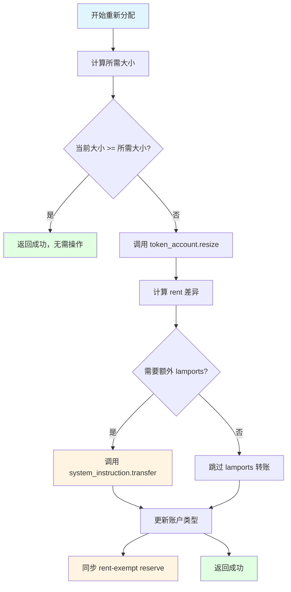
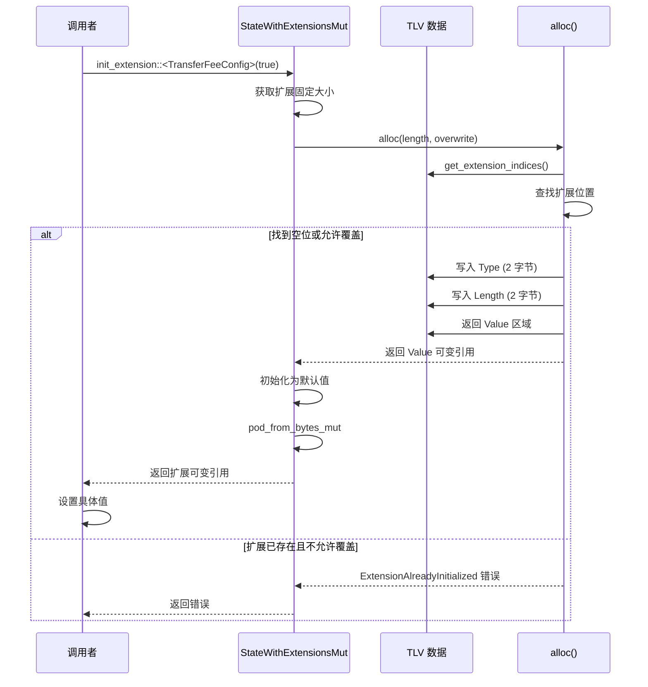

# 扩展初始化机制深度分析

## 📋 分析概览
- **分析主题**: Extension Initialization Mechanism
- **项目**: Solana Token 2022
- **分析时间**: 2026-03-09 23:30:00 GMT+8
- **分析状态**: ✅ 完成
- **主要代码位置**:
  - `interface/src/extension/mod.rs` (TLV 核心逻辑）
  - `program/src/extension/reallocate.rs` (账户重新分配）

---

## 🎯 核心概念

### 什么是扩展初始化？

扩展初始化是**在账户的 TLV 数据区域中为新扩展分配空间并设置初始值**的过程。

### 两种初始化模式

| 模式 | overwrite 参数 | 适用场景 | 行为 |
|--------|----------------|----------|------|
| **overwrite = true** | Mint 扩展 | 允许覆盖已存在的扩展 |
| **overwrite = false** | Account 扩展 | 只能初始化未存在的扩展 |

**为什么有区别？**
- **Mint**: 单例，允许多次更新配置
- **Account**: 每个独立，防止重复初始化

---

## 🏗️ TLV 数据管理

### 1. 扩展查找算法

```rust
fn get_extension_indices<V: Extension>(
    tlv_data: &[u8],
    init: bool,
) -> Result<TlvIndices, ProgramError> {
    let mut start_index = 0;
    
    while start_index < tlv_data.len() {
        let tlv_indices = get_tlv_indices(start_index);
        
        // 读取 Type
        let extension_type = u16::from_le_bytes(
            tlv_data[tlv_indices.type_start..tlv_indices.length_start]
        );
        
        // 找到目标扩展？
        if extension_type == u16::from(V::TYPE) {
            return Ok(tlv_indices);
        }
        // 找到空位？
        else if extension_type == u16::from(ExtensionType::Uninitialized) {
            if init {
                return Ok(tlv_indices);  // 初始化模式：返回空位
            } else {
                return Err(TokenError::ExtensionNotFound.into());  // 搜索模式：错误
            }
        }
        // 跳过当前扩展
        else {
            let length = pod_from_bytes::<Length>(...)?;
            let value_end_index = tlv_indices.value_start.saturating_add(usize::from(*length));
            start_index = value_end_index;
        }
    }
    
    Err(ProgramError::InvalidAccountData)
}
```

**算法复杂度**: O(n)，n = 扩展数量（通常 < 10）

### 2. 扩展分配算法（alloc）

```rust
fn alloc<V: Extension>(
    &mut self,
    length: usize,
    overwrite: bool,
) -> Result<&mut [u8], ProgramError> {
    // 1. 验证扩展类型匹配账户类型
    if V::TYPE.get_account_type() != S::ACCOUNT_TYPE {
        return Err(ProgramError::InvalidAccountData);
    }
    
    // 2. 查找扩展位置
    let tlv_data = self.get_tlv_data_mut();
    let TlvIndices {
        type_start,
        length_start,
        value_start,
    } = get_extension_indices::<V>(tlv_data, true)?;
    
    // 3. 验证空间足够
    if tlv_data[type_start..].len() < add_type_and_length_to_len(length) {
        return Err(ProgramError::InvalidAccountData);
    }
    
    // 4. 读取当前位置的扩展类型
    let extension_type = ExtensionType::try_from(&tlv_data[type_start..length_start])?;
    
    // 5. 关键判断：是否可以写入
    if extension_type == ExtensionType::Uninitialized || overwrite {
        // ✅ 可以写入
        
        // 写入 Type (2 字节)
        let extension_type_array: [u8; 2] = V::TYPE.into();
        tlv_data[type_start..length_start].copy_from_slice(&extension_type_array);
        
        // 写入 Length (2 字节)
        let length_ref = pod_from_bytes_mut::<Length>(
            &mut tlv_data[length_start..value_start]
        )?;
        
        // 验证：覆盖模式下长度必须相同
        if overwrite && extension_type == V::TYPE && usize::from(*length_ref) != length {
            return Err(TokenError::InvalidLengthForAlloc.into());
        }
        
        *length_ref = Length::try_from(length)?;
        
        // 返回 Value 区域
        let value_end = value_start.saturating_add(length);
        Ok(&mut tlv_data[value_start..value_end])
    } else {
        // ❌ 扩展已存在且不允许覆盖
        Err(TokenError::ExtensionAlreadyInitialized.into())
    }
}
```

**关键逻辑**:
- **验证 1**: 扩展类型与账户类型匹配（Mint vs Account）
- **验证 2**: 空间足够（Type + Length + Value）
- **验证 3**: 覆盖模式下长度必须相同
- **写入**: Type → Length → Value

### 3. 扩展初始化算法（init_extension）

```rust
fn init_extension<V: Extension + Pod + Default>(
    &mut self,
    overwrite: bool,
) -> Result<&mut V, ProgramError> {
    // 1. 获取扩展的固定大小
    let length = pod_get_packed_len::<V>();
    
    // 2. 调用 alloc 分配空间
    let buffer = self.alloc::<V>(length, overwrite)?;
    
    // 3. 将字节转换为扩展类型的可变引用
    let extension_ref = pod_from_bytes_mut::<V>(buffer)?;
    
    // 4. 初始化为默认值
    *extension_ref = V::default();
    
    // 5. 返回可变引用，供调用者设置具体值
    Ok(extension_ref)
}
```

**使用示例**:
```rust
// TransferFeeConfig 初始化
let extension = mint.init_extension::<TransferFeeConfig>(true)?;
extension.transfer_fee_config_authority = authority.try_into()?;
extension.withdraw_withheld_authority = withdraw_authority.try_into()?;
extension.withheld_amount = 0u64.into();

// ConfidentialTransferAccount 初始化
let confidential_account = 
    token_account.init_extension::<ConfidentialTransferAccount>(false)?;
confidential_account.approved = true.into();
confidential_account.elgamal_pubkey = elgamal_pubkey;
```

### 4. 扩展重新分配算法（realloc）

```rust
fn realloc<V: Extension + VariableLenPack>(
    &mut self,
    length: usize,
) -> Result<&mut [u8], ProgramError> {
    let tlv_data = self.get_tlv_data_mut();
    
    // 1. 获取扩展位置
    let TlvIndices {
        type_start: _,
        length_start,
        value_start,
    } = get_extension_indices::<V>(tlv_data, false)?;
    
    // 2. 计算当前使用的 TLV 总长度
    let tlv_len = get_tlv_data_info(tlv_data).map(|x| x.used_len)?;
    let data_len = tlv_data.len();
    
    // 3. 读取当前长度
    let length_ref = pod_from_bytes_mut::<Length>(
        &mut tlv_data[length_start..value_start]
    )?;
    let old_length = usize::from(*length_ref);
    
    // 4. 长度检查
    if old_length < length {
        let new_tlv_len = tlv_len.saturating_add(
            length.saturating_sub(old_length)
        );
        if new_tlv_len > data_len {
            return Err(ProgramError::InvalidAccountData);
        }
    }
    
    // 5. 写入新长度
    *length_ref = Length::try_from(length)?;
    
    // 6. 移动后续数据
    let old_value_end = value_start.saturating_add(old_length);
    let new_value_end = value_start.saturating_add(length);
    tlv_data.copy_within(old_value_end..tlv_len, new_value_end);
    
    // 7. 根据大小变化处理
    match old_length.cmp(&length) {
        Ordering::Greater => {
            // 重新分配到更小：清空末尾
            let new_tlv_len = tlv_len.saturating_sub(
                old_length.saturating_sub(length)
            );
            tlv_data[new_tlv_len..tlv_len].fill(0);
        }
        Ordering::Less => {
            // 重新分配到更大：清空新字节
            tlv_data[old_value_end..new_value_end].fill(0);
        }
        Ordering::Equal => {}  // 大小相同，无需操作
    }
    
    // 8. 返回新的 Value 区域
    Ok(&mut tlv_data[value_start..new_value_end])
}
```

**关键逻辑**:
- **数据移动**: `copy_within` - 高效的内存复制
- **零初始化**: 新分配的字节初始化为 0
- **三种情况**:
  - 扩大：移动数据 + 清空尾部
  - 缩小：移动数据 + 清空空出的空间
  - 相同：无需操作

---

## 🔄 账户重新分配流程

### 完整的重新分配流程



### 重新分配指令处理

```rust
fn process_reallocate(
    program_id: &Pubkey,
    accounts: &[AccountInfo],
    new_extension_types: Vec<ExtensionType>,
) -> ProgramResult {
    // 1. 验证账户和所有者
    let (current_extension_types, native_token_amount) = 
        validate_account_and_owner(...)?;
    
    // 2. 检查所有新扩展都是 Account 类型
    if new_extension_types.iter().any(|ext| {
        ext.get_account_type() != AccountType::Account
    }) {
        return Err(TokenError::InvalidState.into());
    }
    
    // 3. 计算所需的总大小
    current_extension_types.extend_from_slice(&new_extension_types);
    let needed_account_len = ExtensionType::try_calculate_account_len::<Account>(
        &current_extension_types
    )?;
    
    // 4. 如果已经足够大，返回
    if token_account_info.data_len() >= needed_account_len {
        return Ok(());
    }
    
    // 5. 调用 resize（CPI 到系统程序）
    msg!("account needs resize, +{:?} bytes", 
        needed_account_len - token_account_info.data_len());
    token_account_info.resize(needed_account_len)?;
    
    // 6. 如果需要额外 lamports，转账
    let rent = Rent::get()?;
    let new_rent_exempt_reserve = rent.minimum_balance(needed_account_len);
    
    let current_lamport_reserve = token_account_info
        .lamports()
        .checked_sub(native_token_amount.unwrap_or(0))
        .ok_or(TokenError::Overflow)?;
    let lamports_diff = new_rent_exempt_reserve.saturating_sub(current_lamport_reserve);
    
    if lamports_diff > 0 {
        invoke(
            system_instruction::transfer(payer, token_account, lamports_diff),
            &[
                payer_info.clone(),
                token_account_info.clone(),
                system_program_info.clone(),
            ],
        )?;
    }
    
    // 7. 设置账户类型
    set_account_type::<Account>(&mut token_account_data)?;
    
    // 8. 同步 rent-exempt reserve（用于原生代币）
    if let Some(native_token_amount) = native_token_amount {
        let mut token_account = StateWithExtensionsMut::<Account>::unpack(...)?;
        token_account.base.is_native = COption::Some(new_rent_exempt_reserve);
        token_account.pack_base();
    }
    
    Ok(())
}
```

**关键步骤**:
1. 验证账户和所有者
2. 计算所需大小
3. 调用 `resize`（CPI）
4. 转账 lamports（如果需要）
5. 设置账户类型
6. 同步 rent-exempt reserve

---

## 🔒 安全性分析

### 1. 类型安全检查

```rust
if V::TYPE.get_account_type() != S::ACCOUNT_TYPE {
    return Err(ProgramError::InvalidAccountData);
}
```

**防止的错误**:
- Mint 扩展不能用于 Account
- Account 扩展不能用于 Mint
- 编译时类型检查

### 2. 空间边界检查

```rust
if tlv_data[type_start..].len() < add_type_and_length_to_len(length) {
    return Err(ProgramError::InvalidAccountData);
}
```

**防止的错误**:
- 缓冲区溢出
- 读取未分配的内存
- 数据损坏

### 3. 重复初始化防护

```rust
if extension_type == ExtensionType::Uninitialized || overwrite {
    // 允许写入
} else {
    Err(TokenError::ExtensionAlreadyInitialized.into())
}
```

**两层控制**:
- **overwrite = true**: 允许覆盖（Mint 扩展）
- **overwrite = false**: 防止重复初始化（Account 扩展）

### 4. 长度一致性检查

```rust
if overwrite && extension_type == V::TYPE && usize::from(*length_ref) != length {
    return Err(TokenError::InvalidLengthForAlloc.into());
}
```

**目的**: 覆盖模式下，扩展的固定大小不能改变

### 5. 重新分配时的长度检查

```rust
if old_length < length {
    let new_tlv_len = tlv_len.saturating_add(length.saturating_sub(old_length));
    if new_tlv_len > data_len {
        return Err(ProgramError::InvalidAccountData);
    }
}
```

**防止的错误**:
- 扩展超出账户总大小
- 数据截断
- 内存访问越界

---

## ⚡ 性能分析

### 1. 操作复杂度

| 操作 | 时间复杂度 | 说明 |
|------|-------------|------|
| `get_extension_indices` | O(n) | n = 扩展数量 |
| `alloc` | O(n) | 主要是查找开销 |
| `init_extension` | O(n) | alloc + 默认值初始化 |
| `realloc` | O(n) | 数据移动 O(n) |
| `resize` (CPI) | O(1) | 系统调用 |

### 2. 内存操作

| 操作 | 内存模式 | 说明 |
|------|----------|------|
| `copy_within` | 原地操作 | 不需要额外缓冲区 |
| `fill(0)` | 原地操作 | 零初始化 |
| `copy_from_slice` | 拷贝操作 | 复制小量数据 |

### 3. 链上成本

| 操作 | 计算单元 | 说明 |
|------|-----------|------|
| 初始化扩展 | ~1,000 CU | TLV 写入 |
| 重新分配账户 | ~5,000 CU | CPI 调用 |
| 扩展扩展 | ~10,000 CU | 数据移动 + 清零 |
| **总计** | **~16,000 CU** | **重新分配成本** |

---

## 💡 实战示例

### 示例 1: 初始化 Mint 扩展

```rust
fn process_initialize_mint_with_fee(
    accounts: &[AccountInfo],
    authority: Pubkey,
    transfer_fee_config_authority: Pubkey,
    withdraw_withheld_authority: Pubkey,
    transfer_fee_basis_points: u16,
    maximum_fee: u64,
) -> ProgramResult {
    let mint_account_info = next_account_info(accounts)?;
    let mut mint_data = mint_account_info.data.borrow_mut();
    let mut mint = PodStateWithExtensionsMut::<PodMint>::unpack_uninitialized(&mut mint_data)?;
    
    // 初始化 TransferFeeConfig（overwrite = true）
    let extension = mint.init_extension::<TransferFeeConfig>(true)?;
    
    // 设置配置
    extension.transfer_fee_config_authority = transfer_fee_config_authority.try_into()?;
    extension.withdraw_withheld_authority = withdraw_withheld_authority.try_into()?;
    extension.withheld_amount = 0u64.into();
    
    let epoch = Clock::get()?.epoch;
    let transfer_fee = TransferFee {
        epoch: epoch.into(),
        transfer_fee_basis_points: transfer_fee_basis_points.into(),
        maximum_fee: maximum_fee.into(),
    };
    extension.older_transfer_fee = transfer_fee;
    extension.newer_transfer_fee = transfer_fee;
    
    Ok(())
}
```

### 示例 2: 初始化 Account 扩展

```rust
fn process_initialize_account_with_confidential(
    accounts: &[AccountInfo],
    authority: Pubkey,
    elgamal_keypair: &ElGamalKeypair,
) -> ProgramResult {
    let token_account_info = next_account_info(accounts)?;
    let mut account_data = token_account_info.data.borrow_mut();
    let mut account = PodStateWithExtensionsMut::<PodAccount>::unpack(&mut account_data)?;
    
    // 初始化 ConfidentialTransferAccount（overwrite = false）
    let confidential_account = account.init_extension::<ConfidentialTransferAccount>(false)?;
    
    // 设置扩展数据
    confidential_account.elgamal_pubkey = elgamal_keypair.pubkey();
    confidential_account.pending_balance_lo = ElGamalCiphertext::default();
    confidential_account.pending_balance_hi = ElGamalCiphertext::default();
    confidential_account.available_balance = confidential_account.pending_balance_lo;
    
    confidential_account.pending_balance_credit_counter = 0;
    confidential_account.maximum_pending_balance_credit_counter = 
        DEFAULT_MAXIMUM_PENDING_BALANCE_CREDIT_COUNTER;
    
    Ok(())
}
```

### 示例 3: 动态调整扩展大小

```rust
fn process_update_metadata(
    accounts: &[AccountInfo],
    new_metadata: &TokenMetadata,
) -> ProgramResult {
    let mint_account_info = next_account_info(accounts)?;
    let mut mint_data = mint_account_info.data.borrow_mut();
    let mut mint = PodStateWithExtensionsMut::<PodMint>::unpack(&mut mint_data)?;
    
    // 重新分配 TokenMetadata 扩展（可变长度）
    let packed_len = new_metadata.get_packed_len()?;
    mint.realloc_variable_len_extension::<TokenMetadata>(new_metadata)?;
    
    // 元数据已写入 TLV 数据
    
    Ok(())
}
```

---

## 🎨 设计模式分析

### 1. Strategy Pattern（策略模式）

**实现**: `overwrite` 参数作为策略

**优点**:
- 运行时决定初始化行为
- Mint vs Account 的不同策略
- 类型安全的策略选择

### 2. Builder Pattern（建造者模式）

**实现**: 链式调用设置扩展值

**示例**:
```rust
let extension = mint.init_extension::<TransferFeeConfig>(true)?;
extension.transfer_fee_config_authority = authority.try_into()?;
extension.withdraw_withheld_authority = withdraw_authority.try_into()?;
extension.withheld_amount = 0u64.into();
```

**优点**:
- 分步配置
- 可读性高
- 易于扩展

### 3. Template Method Pattern（模板方法）

**实现**: `init_extension` 作为模板方法

**优点**:
- 统一的初始化流程
- 减少代码重复
- 类型安全

---

## 📊 数据流图

### 扩展初始化完整流程



### 重新分配完整流程

```mermaid
sequenceDiagram
    participant Caller as 调用者
    participant State as StateWithExtensionsMut
    participant TLV as TLV 数据
    participant Realloc as realloc()
    participant Move as 数据移动

    Caller->>State: realloc_variable_len_extension::<TokenMetadata>(new_metadata)
    State->>State: 计算新长度
    State->>Realloc: realloc(length)
    Realloc->>TLV: get_extension_indices()
    Realloc->>TLV: 读取当前长度
    Realloc->>Realloc: 验证空间足够
    Realloc->>TLV: 写入新长度
    
    Realloc->>Move: copy_within(old_value_end..tlv_len, new_value_end)
    
    alt 扩大
        Realloc->>TLV: fill(0) 清空末尾
    else 缩小
        Realloc->>TLV: fill(0) 清空空出的空间
    else 相同
        Realloc->>TLV: 无需操作
    
    Move-->>Realloc: 移动完成
    Realloc-->>State: 返回新的 Value 区域
    State->>State: pack_into_slice(new_data)
    State-->>Caller: 返回成功
```

---

## 📚 学习价值

### 1. 可变长度数据管理

- TLV 格式的动态扩展
- 空间分配和重新分配
- 数据移动和清理
- 内存安全保证

### 2. 类型安全的扩展系统

- 泛型约束（V: Extension）
- 账户类型验证（Mint vs Account）
- 编译时类型检查
- 运行时类型验证

### 3. Rust 高级特性

- Trait 系统设计
- 生命周期管理
- 零拷贝抽象（Pod）
- 错误处理模式

### 4. 区块链账户管理

- 账户重新分配
- Rent 计算
- Lamports 管理
- CPI 调用集成

---

## 🔗 相关资源

- **核心实现**:
  - `interface/src/extension/mod.rs` - TLV 核心逻辑
  - `program/src/extension/reallocate.rs` - 账户重新分配
  - `TLV_EXTENSION_ARCHITECTURE.md` - 架构文档
  - `INIT_EXTENSION_GUIDE.md` - 初始化指南

---

## 🔍 深入理解要点

### 1. 为什么 Mint 和 Account 有不同的 overwrite 策略？

**Mint (overwrite = true)**:
- Mint 是单例（只有一个）
- 需要多次更新配置
- 例如：更新费用、更改权限

**Account (overwrite = false)**:
- 每个账户独立
- 防止重复初始化
- 保护现有数据不被覆盖

### 2. `copy_within` vs 普通拷贝

**`copy_within` 的优势**:
- 原地操作（不需要额外缓冲区）
- 高效（直接内存复制）
- 安全（边界检查）

**普通拷贝的问题**:
- 需要临时缓冲区
- 双倍内存占用
- 较慢（两次拷贝）

### 3. 重新分配时的三种情况

```
1. 扩大（length > old_length）:
   - 移动数据向后
   - 清空新分配的字节

2. 缩小（length < old_length）:
   - 移动数据向前
   - 清空空出的字节

3. 相同（length == old_length）:
   - 无需任何操作
```

### 4. 账户类型的动态检查

```rust
V::TYPE.get_account_type() != S::ACCOUNT_TYPE
```

**编译时保证**:
- Mint 扩展只能用于 Mint
- Account 扩展只能用于 Account
- 防止类型混淆

---

*本深度分析文档由 project-analyzer 技能生成*
*生成时间: 2026-03-09 23:30:00 GMT+8*
