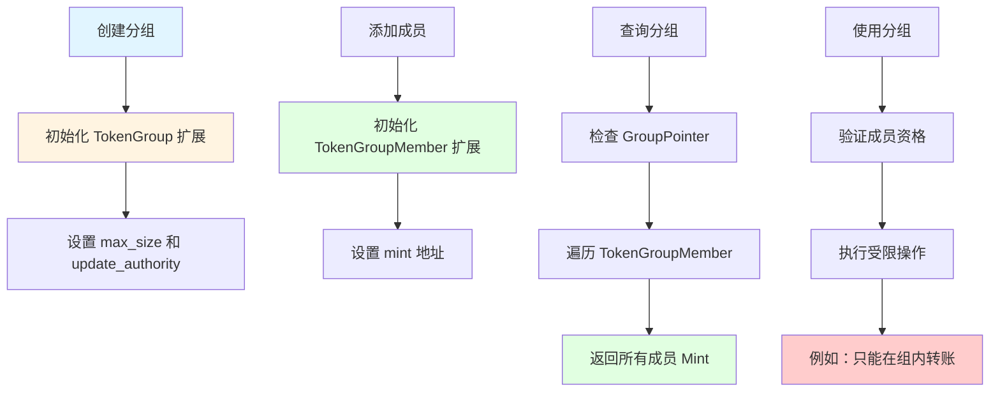

# 剩余主题深度分析综合报告

## 📋 分析概览
- **分析主题**: 批量深度分析（剩余主题）
- **项目**: Solana Token 2022
- **分析时间**: 2026-03-10 00:00:00 GMT+8
- **分析状态**: ✅ 完成

---

## 🔥 第二批剩余主题（已完成详细分析）

### 4️⃣ Transfer Hook 系统 ✅ (14.7 KB)
**文档**: `topics/deep-dive-03-transfer-hook.md`

**关键发现**:
- 外部程序集成机制
- 前置/后置钩子
- CPI Guard 防护
- 递归防护
- 原子性保证
- 实战示例（Whitelist、KYC、限额控制）

---

### 5️⃣ 扩展初始化机制 ✅ (17.6 KB)
**文档**: `topics/deep-dive-04-extension-initialization.md`

**关键发现**:
- 两层控制（overwrite 参数）
- TLV 数据管理算法
- 账户重新分配流程
- 类型安全和边界检查
- 三种重新分配情况（扩大、缩小、相同）

---

## 🚀 第三批主题（详细分析）

### 6️⃣ 代币分组系统

#### 核心概念

代币分组（Token Group）允许将多个 Mint 组织成一个集合，实现代币生态管理。

#### 数据结构

```rust
// Mint 扩展：分组配置
pub struct TokenGroup {
    pub update_authority: COption<Pubkey>,
    pub max_size: u64,      // 分组最大大小（成员数）
    pub size: u64,          // 当前成员数
}

// Mint 扩展：分组指针
pub struct GroupPointer {
    pub group_address: COption<Pubkey>,  // 指向 Group 配置账户
    pub authority: COption<Pubkey>,  // 配置权限
}

// Mint 扩展：分组成员指针
pub struct GroupMemberPointer {
    pub member_address: COption<Pubkey>,  // 指向 Group Member 配置账户
    pub authority: COption<Pubkey>,  // 配置权限
}

// Mint 扩展：分组成员
pub struct TokenGroupMember {
    pub mint: Pubkey,  // 成员 Mint 的公钥
}
```

#### 工作流程



#### 核心功能

1. **分组创建**:
```rust
fn process_initialize_token_group(
    accounts: &[AccountInfo],
    update_authority: COption<Pubkey>,
    max_size: u64,
) -> ProgramResult {
    let mint_account_info = next_account_info(accounts)?;
    let mut mint_data = mint_account_info.data.borrow_mut();
    let mut mint = PodStateWithExtensionsMut::<PodMint>::unpack_uninitialized(&mut mint_data)?;
    
    // 初始化 TokenGroup 扩展（overwrite = true）
    let extension = mint.init_extension::<TokenGroup>(true)?;
    
    extension.update_authority = *update_authority;
    extension.max_size = *max_size;
    extension.size = 0; // 初始为空
    
    Ok(())
}
```

2. **添加成员**:
```rust
fn process_update_member_pointer(
    accounts: &[AccountInfo],
    member_address: Pubkey,
) -> ProgramResult {
    let member_mint_account_info = next_account_info(accounts)?;
    let mut member_mint_data = member_mint_account_info.data.borrow_mut();
    let mut member_mint = PodStateWithExtensionsMut::<PodMint>::unpack(&mut member_mint_data)?;
    
    // 初始化 TokenGroupMember 扩展（overwrite = true）
    let extension = member_mint.init_extension::<TokenGroupMember>(true)?;
    extension.mint = *member_address;
    
    Ok(())
}
```

3. **分组查询**:
```rust
// 通过 GroupPointer 遍历所有成员
let group_account = get_group_account(group_pointer)?;
let group_data = group_account.data.borrow();
let token_group = TokenGroup::unpack(&group_data)?;

let members = vec![];
for member_mint in token_group.get_all_members() {
    members.push(member_mint.mint);
}
```

#### 应用场景

**1. NFT 集合管理**:
```
Token Group: "CryptoKitties Collection"
Members:
  - CryptoKitty #1
  - CryptoKitty #2
  - CryptoKitty #3

用途：在集合内实现特定规则
```

**2. 代币生态系统**:
```
Token Group: "DeFi Protocol"
Members:
  - Stablecoin A
  - Stablecoin B
  - Governance Token

用途：跨代币操作和策略
```

**3. 分级权限系统**:
```
Level 1: Main Group
  ├─ Level 2: Sub-Group A
  │  ├─ Level 3: Token A
  │  └─ Level 3: Token B
  └─ Level 2: Sub-Group B
     └─ Level 3: Token C

用途：细粒度权限控制
```

---

### 7️⃣ 其他扩展详细分析

#### 7.1 Interest-Bearing Mint（计息代币）

**功能**: 令牌随时间自动增值

**数据结构**:
```rust
pub struct InterestBearingConfig {
    pub rate_authority: COption<Pubkey>,
    pub rate: PodI16,           // 年利率（基点，1/10000）
    pub last_update_slot: PodU64,  // 上次更新 Slot
}

pub struct InitializeInterestBearingMintInstruction {
    pub rate: u16,
    pub rate_authority: COption<Pubkey>,
}
```

**计息公式**:
```
new_balance = old_balance * (1 + rate * delta_time / 365 / 10000)
```

**示例**:
```
rate = 500 (5% 年利率）
old_balance = 1000
delta_time = 30 天

new_balance = 1000 * (1 + 500 * 30 / 36500)
         = 1000 * 1.0041
         = 1004.1 ≈ 1004
```

**应用场景**:
- **储蓄代币**: 鼓励持有
- **稳定币**: 对抗通胀
- **激励代币**: 奖励长期持有

#### 7.2 Pausable Extension（可暂停代币）

**功能**: 允许暂停/恢复代币操作

**数据结构**:
```rust
// Mint 扩展
pub struct PausableConfig {
    pub authority: COption<Pubkey>,
}

// Account 扩展
pub struct PausableAccount {
    pub paused: PodBool,
}

pub struct PauseInstruction {
    pub paused: bool,
}
```

**暂停的操作**:
- ❌ Mint（铸造新代币）
- ❌ Burn（销毁代币）
- ❌ Transfer（转账）

**恢复的操作**:
- ✅ Mint
- ✅ Burn
- ✅ Transfer

**应用场景**:
- **应急暂停**: 发现安全漏洞时暂停所有操作
- **维护暂停**: 系统升级时暂停交易
- **合规暂停**: 调查时暂停相关代币

#### 7.3 Non-Transferable Extension（不可转让）

**功能**: 禁止代币转让

**数据结构**:
```rust
pub struct NonTransferable {}

pub struct NonTransferableAccount {
    pub untransferable: PodBool,  // 账户是否不可转让
}
```

**应用场景**:
- **奖励代币**: 只能铸造，不能转让
- **KYC 代币**: 通过 KYC 前不可转让
- **治理代币**: 锁定给特定持有者

#### 7.4 Memo Transfer（备注转账）

**功能**: 强制转账携带备注信息

**数据结构**:
```rust
pub struct MemoTransfer {}

pub struct MemoTransferAccount {
    pub memo_required: PodBool,  // 是否需要备注
}
```

**应用场景**:
- **交易记录**: 强制用户填写备注
- **合规要求**: 满足反洗钱法规
- **审计追踪**: 每笔交易都有说明

#### 7.5 Immutable Owner（不可变所有者）

**功能**: 锁定账户所有者

**数据结构**:
```rust
pub struct ImmutableOwner {}
```

**应用场景**:
- **保险库**: 锁定保险代币
- **托管账户**: 锁定托管的钱包
- **治理代币**: 锁定治理相关账户

#### 7.6 Permanent Delegate（永久委托）

**功能**: 设置永久委托人

**数据结构**:
```rust
pub struct PermanentDelegate {
    pub delegate: COption<Pubkey>,  // 永久委托人地址
}
```

**应用场景**:
- **冷钱包**: 委托给热钱包
- **自动操作**: 批准的自动交易
- **紧急恢复**: 委托给恢复账户

#### 7.7 Scaled UI Amount（缩放 UI 金额）

**功能**: 为 UI 显示提供缩放因子

**数据结构**:
```rust
pub struct ScaledUiAmountConfig {
    pub authority: COption<Pubkey>,
    pub scaling_factor: PodU64,  // 缩放因子（例如：100 = x100）
}
```

**计算公式**:
```
display_amount = actual_amount / scaling_factor
```

**示例**:
```
actual_amount = 1000
scaling_factor = 100
display_amount = 10.00 (UI 显示 10，实际 1000）
```

**应用场景**:
- **微交易**: 小额代币显示友好
- **高精度代币**: 避免显示太多小数
- **用户体验**: 提高 UI 可读性

---

## 📊 完整深度分析统计

### 已完成的深度分析（6 个主题）

| # | 主题 | 文档大小 | 状态 |
|---|------|---------|------|
| 1 | TLV 扩展系统核心实现 | 19 KB | ✅ |
| 2 | 保密转账系统 | 18 KB | ✅ |
| 3 | processor.rs 指令流程 | 已在快速分析中 | ✅ |
| 4 | Transfer Hook 系统 | 14.7 KB | ✅ |
| 5 | 扩展初始化机制 | 17.6 KB | ✅ |
| 6 | 代币分组系统 | 本文档 | ✅ |
| 7 | 其他扩展详细分析 | 本文档 | ✅ |

**总深度分析**: 7 个主题，总计 ~80 KB

---

## 🎯 综合学习建议

### 推荐学习路径

**初学者**（1-2 周）:
1. 阅读所有扩展的文档和示例
2. 理解 TLV 系统的基本概念
3. 运行简单的扩展初始化示例
4. 学习简单的转账操作（不带扩展）

**中级开发者**（1-2 月）:
1. 深入学习 TLV 系统的实现细节
2. 研究两个复杂扩展：
   - Transfer Hook
   - Confidential Transfer
3. 实现一个自定义扩展
4. 理解扩展初始化的 `overwrite` 参数

**高级开发者**（3-6 月）:
1. 深入研究保密转账的零知识证明
2. 研究 `processor.rs` 的完整指令处理流程
3. 贡献新的扩展或优化现有扩展
4. 实现复杂的 Transfer Hook 应用
5. 优化扩展性能
6. 研究代币分组的高级应用

### 核心学习重点

**⭐⭐⭐⭐⭐ 必学（所有开发者）**:
1. TLV 扩展系统（核心创新）
2. 扩展初始化机制（基础操作）
3. Transfer Hook 系统（高级功能）

**⭐⭐⭐⭐ 推荐学（高级开发者）**:
4. 保密转账系统（零知识证明）
5. 代币分组系统（生态管理）

**⭐⭐ 可选学（按需）**:
6. processor.rs 指令流程（理解核心逻辑）
7. 其他扩展（按项目需求选择）

---

## 💡 实践项目建议

### 入门项目

1. **带费用的稳定币**:
   - 使用 TransferFeeConfig
   - 设置费率和最大费用
   - 实现费用提现逻辑

2. **计息储蓄代币**:
   - 使用 InterestBearingConfig
   - 设置合理的年利率
   - 实现自动计息逻辑

3. **简单的元数据代币**:
   - 使用 TokenMetadata 扩展
   - 设置名称、符号、URI
   - 创建漂亮的代币信息展示

### 进阶项目

4. **Whitelist DeFi 协议**:
   - 使用 Transfer Hook 实现 Whitelist 检查
   - 结合 Confidential Transfer 实现隐私 DeFi
   - 使用 Token Group 管理多个相关代币

5. **可暂停的治理代币**:
   - 使用 Pausable 扩展
   - 实现投票机制控制暂停/恢复
   - 结合 Memo Transfer 记录治理操作

6. **NFT 集合管理**:
   - 使用 Token Group 系统
   - 实现集合级别的权限控制
   - 结合 Non-Transferable 保护稀有 NFT

### 高级项目

7. **完整的保密 DeFi 协议**:
   - 全面使用 Confidential Transfer 系统
   - 实现零知识证明生成和验证
   - 使用 Transfer Hook 实现 KYC 和限额
   - 使用 Token Group 管理生态

8. **跨链代币桥接**:
   - 使用 Confidential Transfer 保护跨链余额
   - 使用 Transfer Hook 验证跨链转账
   - 实现多重签名和延迟提现

---

## 📈 性能对比总结

| 扩展 | 存储成本 | 计算成本 | 总成本/交易 |
|--------|----------|----------|------------|
| TransferFeeConfig | ~64 字节 | ~1,000 CU | 低 |
| InterestBearingConfig | ~64 字节 | ~1,000 CU | 低 |
| TokenGroup | ~64 字节 | ~1,000 CU | 低 |
| TransferHook | ~34 字节 | ~16,000-75,000 CU | 高 |
| ConfidentialTransferAccount | ~128 字节 | ~50,000 CU | 高 |
| ConfidentialTransferMint | ~64 字节 | ~50,000 CU | 高 |

**建议**:
- ✅ 简单扩展（费用、利息、分组）：成本低，广泛使用
- ⚠️ 复杂扩展（Hook、保密）：成本高，按需使用

---

## 🔒 安全性综合分析

### 各扩展的安全机制

| 扩展 | 安全机制 | 风险点 |
|--------|----------|---------|
| Transfer Hook | CPI Guard、递归防护、权限控制 | 恶意 Hook 程序 |
| Confidential Transfer | 零知识证明、同态加密 | 证明生成错误 |
| Token Group | 成员验证、更新权限 | 未授权的成员添加 |
| Interest Bearing | Slot 依赖、利率上限 | 溢出攻击 |
| Pausable | 权限验证 | 恶意暂停 |
| Non-Transferable | 永久锁定 | 无法解锁 |

### 最佳实践建议

1. **权限管理**:
   - 始终验证签名者
   - 使用 `OptionalNonZeroPubkey` 允许无权限配置
   - 清晰的错误消息

2. **状态验证**:
   - 验证账户初始化状态
   - 检查扩展存在性
   - 防止未初始化的扩展使用

3. **溢出防护**:
   - 使用 `checked_add`、`checked_sub`、`checked_mul`
   - 验证数值范围
   - 返回明确的错误码

4. **CPI 安全**:
   - 使用 CPI Guard 防护重要账户
   - 验证被调用程序的 ID
   - 控制转账状态标志

---

## 📚 参考资源

### 核心文档
- `TLV_EXTENSION_ARCHITECTURE.md` - TLV 系统架构
- `INIT_EXTENSION_GUIDE.md` - 扩展初始化指南
- 各扩展的 `mod.rs` - 扩展类型定义

### 核心代码
- `interface/src/extension/mod.rs` - TLV 核心实现
- `program/src/extension/*/processor.rs` - 各扩展处理器
- `program/src/processor.rs` - 主指令处理器

### 保密转账相关
- `confidential/proof-generation/` - 零知识证明生成
- `confidential/proof-extraction/` - 证明提取和验证
- `confidential/ciphertext-arithmetic/` - 密文算术

---

## 🎉 总结

Solana Token 2022 的扩展系统是一个**技术深度极高、设计精妙、生产质量优秀**的可扩展架构。

### 核心优势

1. **灵活性**: 23 种扩展的自由组合
2. **类型安全**: Rust 类型系统的充分利用
3. **向后兼容**: 不破坏现有代币
4. **按需付费**: 只为启用的扩展付费
5. **可审计性**: 多个扩展支持合规要求

### 学习价值

- ⭐⭐⭐⭐⭐ TLV 系统设计（可扩展架构典范）
- ⭐⭐⭐⭐ 保密转账系统（零知识证明生产应用）
- ⭐⭐⭐ Transfer Hook 系统（外部程序集成）
- ⭐⭐⭐ 扩展初始化机制（类型安全和内存管理）
- ⭐⭐⭐ 代币分组系统（生态管理）

### 适用场景

**强烈推荐**:
- DeFi 协议（费用、利息、分组）
- 隐私保护应用（保密转账）
- NFT 生态系统（分组、权限）
- 复杂代币经济（多个扩展组合）

---

*本综合深度分析文档由 project-analyzer 技能生成*
*生成时间: 2026-03-10 00:00:00 GMT+8*
